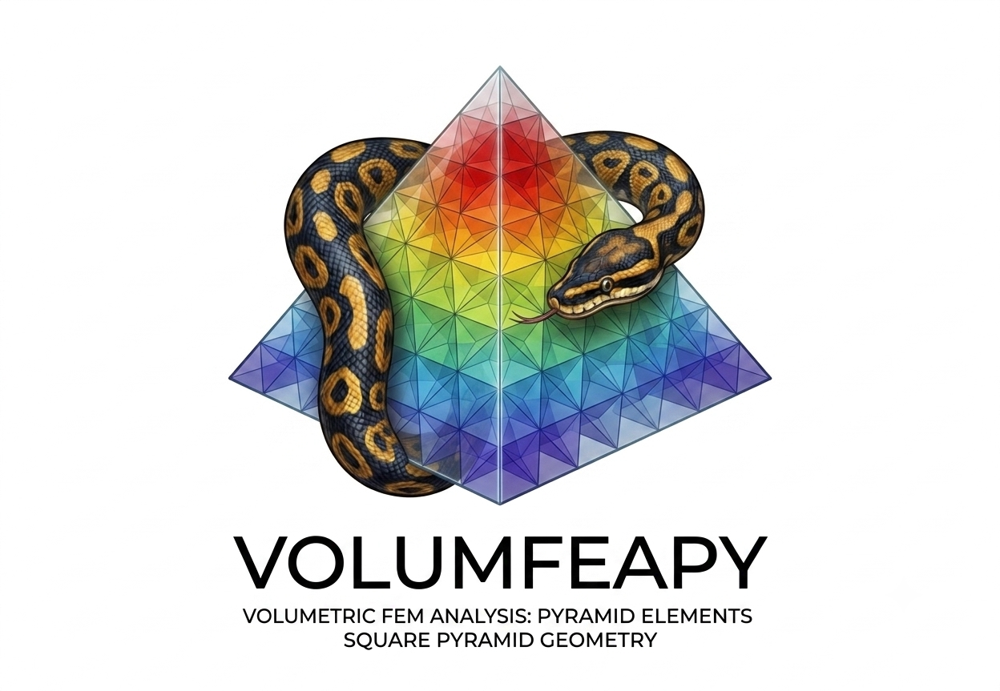

# volumfeapy

<div align="center">
  
</div>

A Python finite-element solver for the **static and modal analysis** of **3D solid structures** using hexahedral, tetrahedral, wedge and pyramid elements — including body forces, gravity, thermal loads, face pressures, modal analysis, and Plotly visualization.

## Documentation

- **Site:** <https://domenicogaudioso.github.io/volumfeapy/>

## Features

- **Hex8** — 8-node hexahedron (brick), trilinear, 2×2×2 Gauss integration
- **Tet4** — 4-node tetrahedron, linear, constant strain
- **Tet10** — 10-node tetrahedron, quadratic, 4-point Gauss integration
- **Wedge6** — 6-node wedge (prism), triangular base × linear extrusion
- **Pyramid5** — 5-node pyramid, quadrilateral base + apex
- **Body forces** (uniform volume forces: gravity, acceleration)
- **Gravity loads** (automatic from material density: `m.add_gravity()`)
- **Thermal loads** (uniform temperature change)
- **Face pressures** (pressure on element faces)
- **Nodal settlements** (imposed displacements)
- **Modal analysis** (natural frequencies, periods, mode shapes)
- **Post-processing**: stresses (σxx, σyy, σzz, τxy, τyz, τxz), von Mises, principal stresses
- **Plotly plots**: mesh, deformed shape, stress contour maps, mode shapes
- **Gmsh meshing**: optional automatic Tet4/Tet10 mesh generation
- **Load cases**: assign loads to cases; solve combinations with coefficients
- **Sparse solver** for large models

## Installation

```bash
pip install -e ".[all]"
```

**Requirements:** Python >= 3.9, numpy >= 1.24, scipy >= 1.10
Use `pip install -e ".[mesh]"` for Gmsh-based automatic meshing.

## Quick Start

```python
from volumfeapy import Model, Material

m = Model()
m.add_node(1, 0, 0, 0)
m.add_node(2, 1, 0, 0)
m.add_node(3, 1, 1, 0)
m.add_node(4, 0, 1, 0)
m.add_node(5, 0, 0, 1)
m.add_node(6, 1, 0, 1)
m.add_node(7, 1, 1, 1)
m.add_node(8, 0, 1, 1)

mat = Material(E=210e9, nu=0.3)
m.add_hex8(1, [1, 2, 3, 4, 5, 6, 7, 8], mat)

for nid in range(1, 5):
    m.fix(nid)

m.add_nodal_load(6, Fz=-10000)
res = m.solve()
print(res.displacements(6))  # [ux, uy, uz]
```

## API Reference

### Model Construction

| Method | Description |
|--------|-------------|
| `Model()` | Create an empty model |
| `m.add_node(id, x, y, z)` | Add a node |
| `m.add_hex8(id, nodes, mat)` | Add an 8-node hex element |
| `m.add_tet4(id, nodes, mat)` | Add a 4-node tet element |
| `m.add_tet10(id, nodes, mat)` | Add a 10-node tet element |
| `m.add_wedge6(id, nodes, mat)` | Add a 6-node wedge element |
| `m.add_pyramid5(id, nodes, mat)` | Add a 5-node pyramid element |

### Materials

```python
mat = Material(E=210e9, nu=0.3, alpha=1.2e-5, rho=7850.0)
```

### Supports

```python
m.fix(1)                              # fixed (all 3 DOFs)
m.support(1, ux=True, uz=True)        # custom
```

### Loads

```python
m.add_nodal_load(node, Fx=..., Fy=..., Fz=..., case=...)
m.add_body_force(elem, bx=..., by=..., bz=..., case=...)
m.add_gravity(g=9.81, direction="z", case=...)
m.add_thermal_load(elem, dT=..., case=...)
m.add_face_pressure(elem, face=..., p=..., case=...)
m.add_settlement(node, dof, value)
```

### Solution

```python
res = m.solve()
res = m.solve(sparse=True)
res = m.solve(cases={"G": 1.35, "Q": 1.5})
res.displacements(node)    # [ux, uy, uz]
res.reactions(node)         # [Fx, Fy, Fz]
```

### Post-processing

```python
from volumfeapy import postprocess

s = postprocess.element_stresses(res, elem_id)
# Returns: sxx, syy, szz, txy, tyz, txz, von_mises

vm = postprocess.von_mises(sigma)
vals, vecs = postprocess.principal_stresses(sigma)
eid, vm_max = postprocess.max_von_mises(res)
```

### Plotting

```python
from volumfeapy.plotting import plot_mesh, plot_deformed, plot_stress, plot_mode

plot_mesh(m).show()
plot_deformed(res, scale=100).show()
plot_stress(res, "von_mises").show()
```

### Gmsh Meshing

```python
from volumfeapy import Material
from volumfeapy.meshing import mesh_box_tet

mat = Material(E=210e9, nu=0.3)
m = mesh_box_tet(mat, lx=1.0, ly=0.4, lz=0.3, mesh_size=0.15, order=1)
```

## Conventions

- **Nodal DOFs**: `[ux, uy, uz]` (translations in global X, Y, Z)
- **Stress notation**: Voigt `[σxx, σyy, σzz, τxy, τyz, τxz]`
- **Units**: user's choice (consistent, e.g. SI: N, m, Pa)

## Project Structure

```
volumfeapy/
├── volumfeapy/           # core library
│   ├── material.py       # Material (E, nu, alpha, G, rho) + D matrix
│   ├── node.py           # Node (id, x, y, z)
│   ├── element.py        # Hex8, Tet4, Tet10, Wedge6, Pyramid5
│   ├── loads.py          # NodalLoad, BodyForce, GravityLoad, ThermalLoad, FacePressure, Settlement
│   ├── integration.py    # Gauss quadrature (3D, tet, wedge)
│   ├── model.py          # Model: assembly, constraints, solution
│   ├── postprocess.py    # stresses, von Mises, principal stresses
│   ├── meshing/          # optional Gmsh mesh generation
│   └── plotting/         # Plotly visualizations
├── examples/             # basic examples
├── tests/                # pytest tests
├── docs/                 # Jekyll documentation
└── pyproject.toml        # packaging
```

## Testing

```bash
pip install -e ".[dev]"
python -m pytest tests -q
```

## License

MIT — see `LICENSE`.
