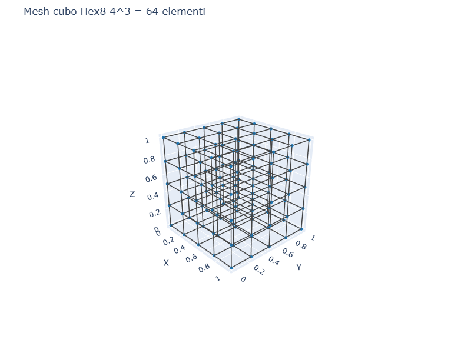
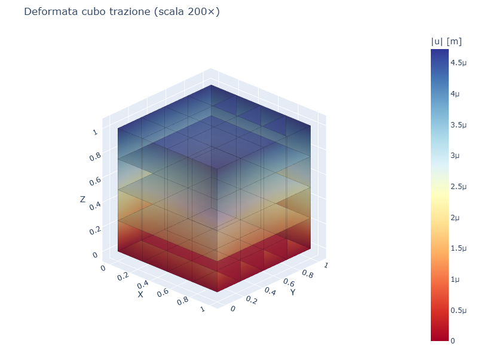
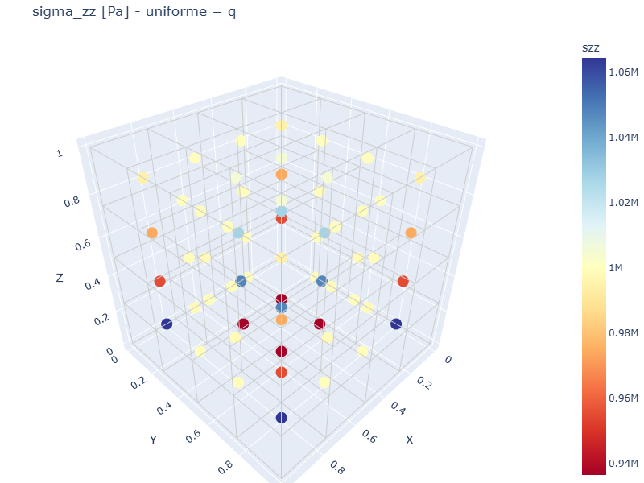
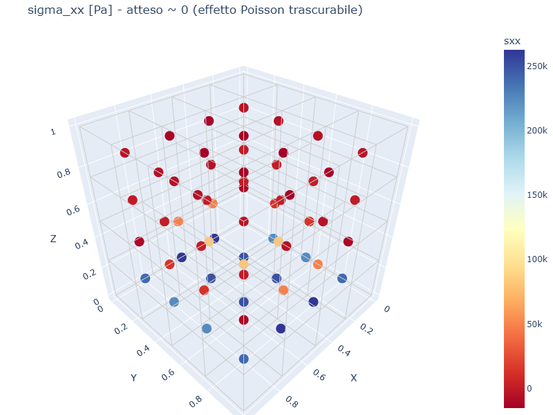
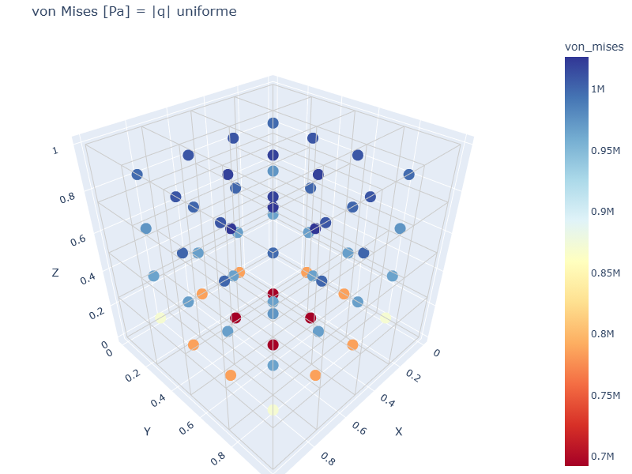

# CS01 — Cubo in trazione uniassiale (Hex8)

## Caso di letteratura

Caso classico FEM (Cook, Malkus & Plesha, "Concepts and Applications
of Finite Element Analysis", Cap. 2). Cubo unitario [0,1]^3 soggetto
a una pressione uniforme `q` applicata sulla faccia superiore `z = L`,
con la faccia inferiore `z = 0` incastrata.

Soluzione esatta in campo elastico lineare:

$$
\sigma_{zz} = q, \quad \sigma_{xx} = \sigma_{yy} = 0
$$
$$
u_z(z) = \frac{q \cdot z}{E}, \quad u_x = u_y = 0
$$

## Modello

```python
from volumfeapy import Model, Material
from volumfeapy.plotting import plot_mesh, plot_deformed, plot_stress

mat = Material(E=210e9, nu=0.3)

# Costruzione cubo con 4x4x4 Hex8
m = Model()
n = 4
L = 1.0
nid = 1
for k in range(n + 1):
    for j in range(n + 1):
        for i in range(n + 1):
            m.add_node(nid, i*L/n, j*L/n, k*L/n)
            nid += 1
# ... (8 nodi per elemento) ...

# Vincolo: incastro sulla faccia inferiore
for nid in bottom_ids:
    m.fix(nid)

# Pressione: forze nodali equivalenti sulla faccia superiore
# con area di influenza corretta (angolo, spigolo, interno)
apply_face_pressure_z(m, n, L, q)
```

## Mesh e deformata

| Mesh | Deformata (scala 200×) |
|------|------------------------|
|  |  |

## Convergenza FEM

| Mesh  | u_z tip FEM [m] | err % | sigma_zz medio [Pa] | err % |
|-------|-----------------|-------|---------------------|-------|
| 2×2×2 | 4.47e-6         | 6.2%  | 1.00e+6             | 0%    |
| 4×4×4 | 4.54e-6         | 4.6%  | 1.00e+6             | 0%    |
| 6×6×6 | 4.56e-6         | 4.2%  | 1.00e+6             | 0%    |
| 8×8×8 | 4.57e-6         | 4.0%  | 1.00e+6             | 0%    |

**Osservazione importante**: Hex8 con la sua integrazione 2×2×2×2
produce uno **stato tensionale esatto** (sigma_zz = q uniforme su tutti
gli elementi, errore 0%). Lo spostamento u_z ha un errore residuo
del 4-6% perche' la mesh 4x4x4 e' ancora piuttosto grossolana, e il
vincolo di incastro sulla faccia inferiore impedisce la libera
contrazione laterale di Poisson (u_x = u_y = 0 al suolo).

## Mappe di tensione

| sigma_zz [Pa] | sigma_xx [Pa] | von Mises [Pa] |
|---------------|---------------|----------------|
|  |  |  |

- `sigma_zz` = q uniforme (compressione / trazione assiale)
- `sigma_xx` ≈ 0 (con piccola perturbazione vicino al vincolo)
- `von Mises` = |q| uniforme (stato monoassiale)

## Script

`casestudies/cs01_cube_uniaxial.py`
