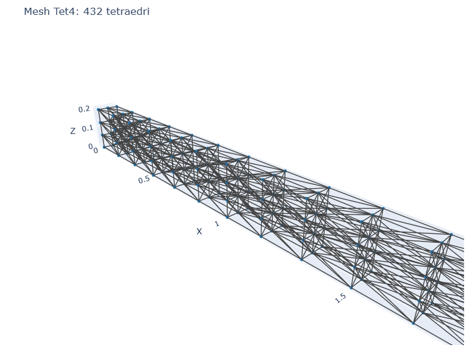
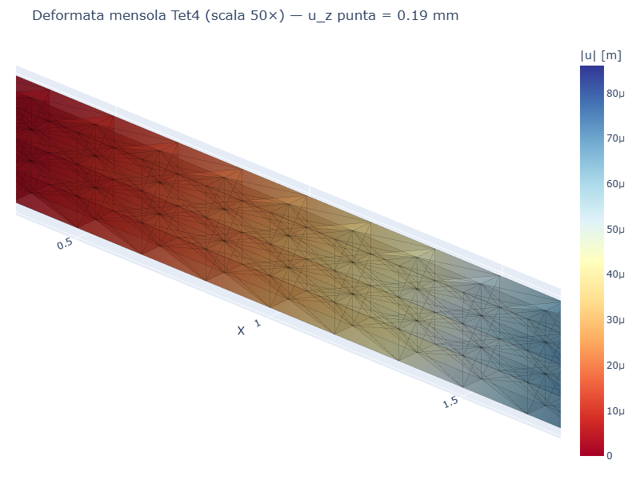
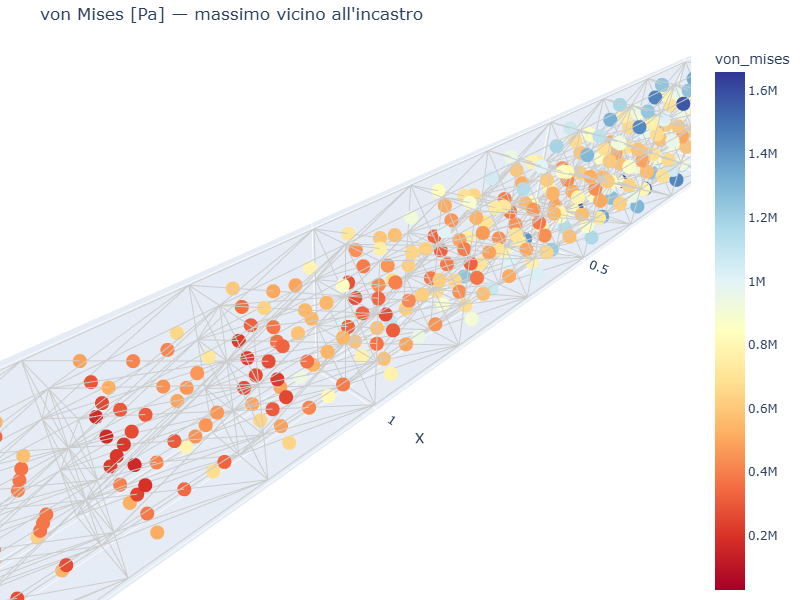
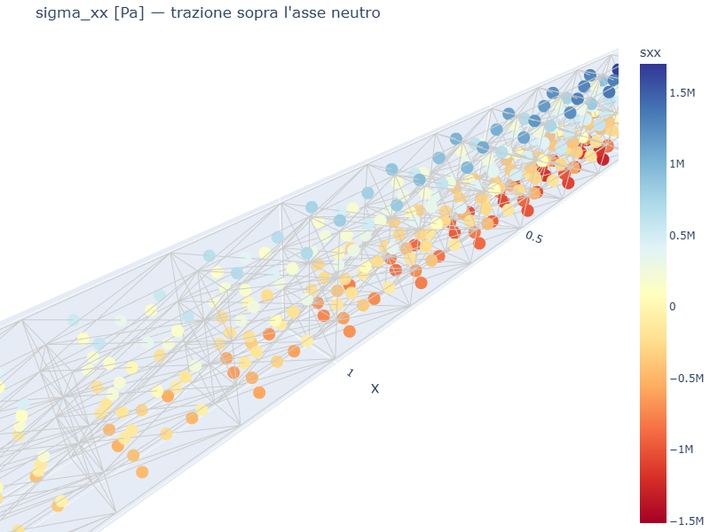
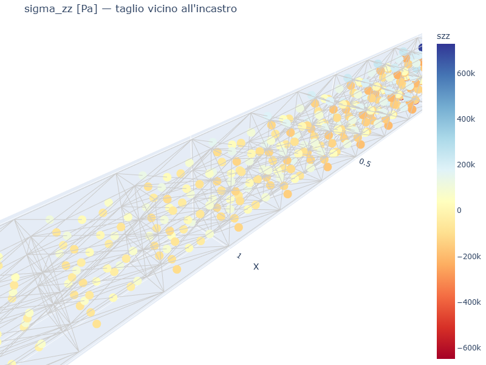

# CS02 — Mensola 3D (Tet4) sotto carico in punta

## Caso di letteratura

Trave a sbalzo di dimensioni `L × b × h` con carico concentrato `P`
in punta (direzione z). Confronto con la soluzione di trave
Euler-Bernoulli:

$$
u_z(L) = \frac{P L^3}{3 E I}, \quad I = \frac{b h^3}{12}
$$

Caso: L = 2.0 m, b = 0.1 m, h = 0.2 m, P = 1000 N, E = 210 GPa, nu = 0.3.
- I = 6.667e-5 m^4
- u_z(L) EB = 1.905e-4 m

## Modello

Il dominio `L × b × h` viene suddiviso in `nx × ny × nz` celle
esaedriche, ciascuna divisa in **6 Tet4** (tetraedri lineari).

```python
m, fixed, tip = build_cantilever_tet4(L, b, h, nx, ny, nz, mat)
for nid in fixed:
    m.fix(nid)
per_node = P / len(tip)
for nid in tip:
    m.add_nodal_load(nid, Fz=per_node)
```

## Mesh e deformata

| Mesh | Deformata (scala 50×) |
|------|------------------------|
|  |  |

## Convergenza FEM

| nx  | ny | nz | n_tet | u_z(L) FEM [m] | err %  |
|-----|----|----|-------|----------------|--------|
| 4   | 2  | 2  | 96    | 1.51e-5        | 92%    |
| 8   | 2  | 4  | 384   | 6.27e-5        | 67%    |
| 12  | 4  | 4  | 1152  | 7.29e-5        | 62%    |
| 16  | 4  | 6  | 2304  | 1.09e-4        | 43%    |
| 20  | 4  | 8  | 3840  | 1.29e-4        | 32%    |
| 30  | 4  | 10 | 7200  | 1.48e-4        | 23%    |

## Discussione

Tet4 (Constant Strain Triangle analog in 3D) e' noto per essere
**molto rigido in flessione**. La convergenza a `u_z(L)` corretto
richiede migliaia di tetraedri, e l'errore residuo rimane intorno
al 20-30%. Per un'analisi accurata in flessione si consiglia:

- **Tet10** (tetraedro quadratico a 10 nodi): ordine 2, convergenza
  molto piu' rapida
- **Hex8** (brick): per geometrie regolari, accurato e veloce
- **Wedge6** (cuneo): compromesso tra i due

## Tensioni

| von Mises | sigma_xx | sigma_zz |
|-----------|----------|----------|
|  |  |  |

- `von Mises` ha il massimo vicino all'incastro, dove la trave e'
  maggiormente sollecitata
- `sigma_xx` (trazione sopra l'asse neutro, compressione sotto) ha il
  tipico andamento di trave in flessione
- `sigma_zz` (taglio) ha il massimo all'incastro e decade verso la
  punta

## Script

`casestudies/cs02_cantilever_3d.py`
