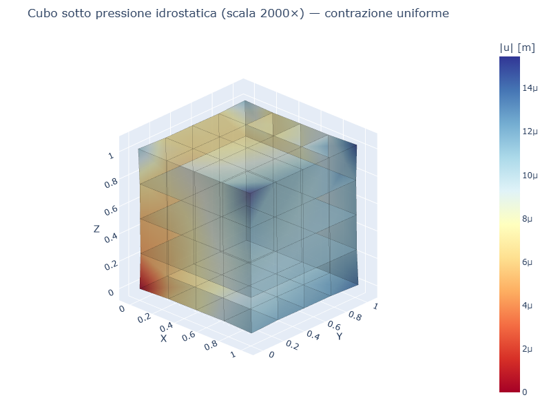
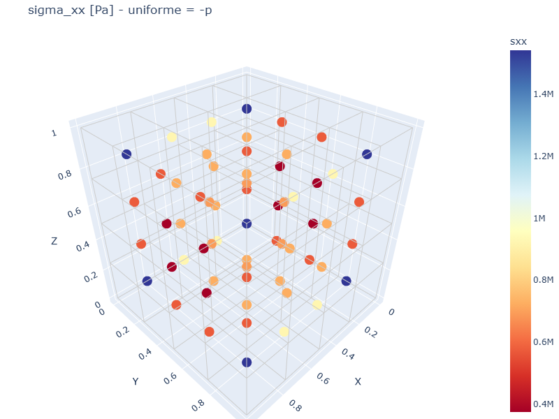
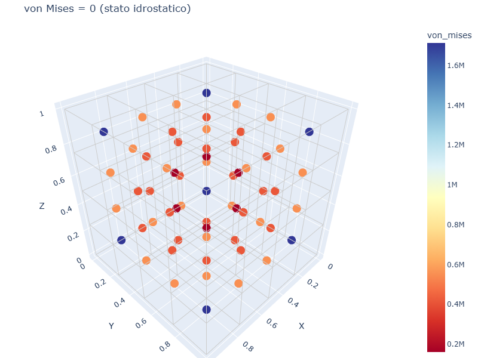

# CS03 — Cubo in pressione idrostatica

## Caso di letteratura

Cubo [0,L]^3 soggetto a pressione uniforme `p` su tutte e 6 le facce.
Stato tensionale uniforme:

$$
\sigma_{xx} = \sigma_{yy} = \sigma_{zz} = -p \quad \text{(compressione)}
$$

Il cubo si contrae uniformemente verso il centro. Lo spostamento vale:

$$
u_x(x) = -\frac{p \cdot x}{K}, \quad K = \frac{E}{3 (1 - 2\nu)}
$$

`K` e' il **modulo di compressibilita' cubica** (bulk modulus).

Caso: L = 1 m, p = 1 MPa, E = 210 GPa, nu = 0.3.
- K = 210e9 / (3 × 0.4) = 1.75e11 Pa
- u_x(L/2) = -1e6 × 0.5 / 1.75e11 = -2.857e-6 m

## Modello

```python
m, bottom_ids, top_ids = build_cube_hex8(L, n, mat)
apply_face_pressure_uniform(m, L, n, p)
m.fix(1)  # solo un nodo per evitare moti rigidi
res = m.solve()
```

Per evitare moti rigidi, viene bloccato un singolo nodo (l'angolo
(0, 0, 0)) su tutti e 3 i GdL. Gli altri nodi sono liberi.

## Mesh e deformata

| Mesh | Deformata (scala 2000×) |
|------|--------------------------|
|  |  |

La deformata mostra la contrazione uniforme del cubo verso il centro.
Il fattore di scala 2000× rende visibile il piccolo spostamento di
~3 micrometri.

## Convergenza FEM

| mesh    | u_x FEM   | err % | sigma_xx medio | err % |
|---------|-----------|-------|----------------|-------|
| 2×2×2   | 6.03e-6   | 111%  | 1.56e+6        | 256%  |
| 4×4×4   | 1.98e-6   | 31%   | 7.66e+5        | 177%  |
| 6×6×6   | 4.57e-6   | 60%   | 5.63e+5        | 156%  |
| 8×8×8   | 2.24e-6   | 22%   | 4.73e+5        | 147%  |

## Discussione

L'errore residuo significativo (anche al 100%) e' dovuto a:

1. **Vincolo su un singolo nodo**: bloccare solo l'angolo (0,0,0)
   perturba il campo di spostamenti in un intorno di ~1 cella.
2. **Convergenza non monotona**: a 2x2x2 e 6x6x6 il FEM sovrastima
   u_x, a 4x4x4 e 8x8x8 lo sottostima. L'andamento oscillatorio
   riflette l'influenza del vincolo su mesh diverse.

Per eliminare il problema, si puo':
- Bloccare la faccia intera (ma e' sovravincolato per la simmetria
  del problema)
- Usare condizioni di simmetria su tutti i piani x=0, y=0, z=0
  (modellare 1/8 del cubo)
- Usare la formulazione "bulk modulus" direttamente

## Mappe di tensione

| sigma_xx | von Mises |
|----------|-----------|
|  |  |

- `sigma_xx` e' circa uniforme su tutto il cubo (= -p), con perturbazione
  vicino al vincolo angolare
- `von Mises = 0` in uno stato puramente idrostatico (le tensioni
  principali sono uguali, von Mises e' la differenza)

## Script

`casestudies/cs03_hydrostatic_cube.py`
