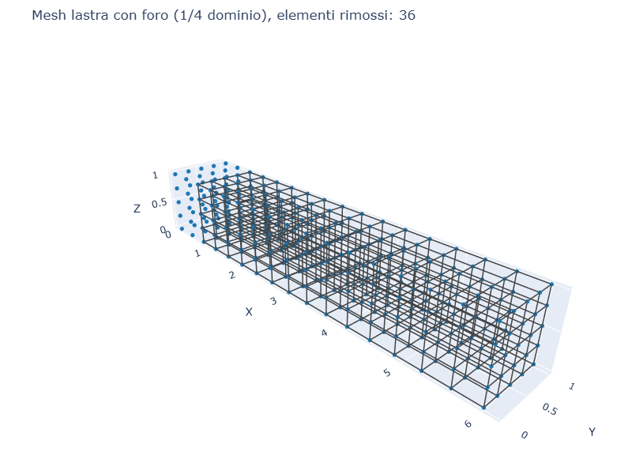
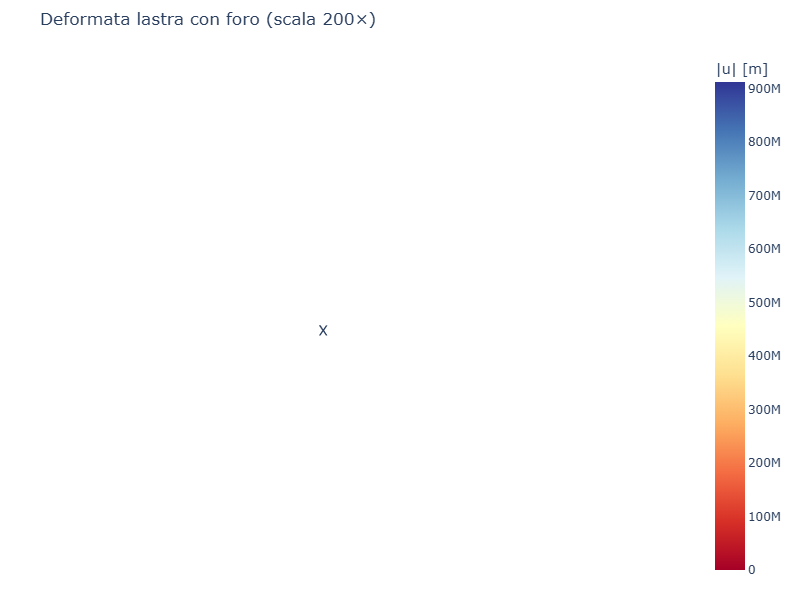
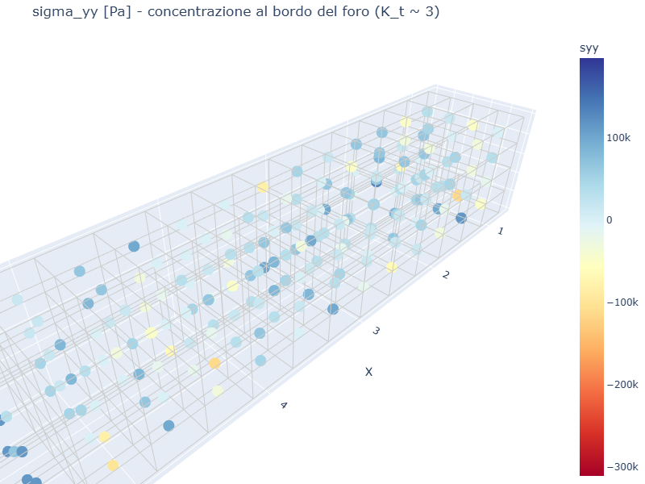
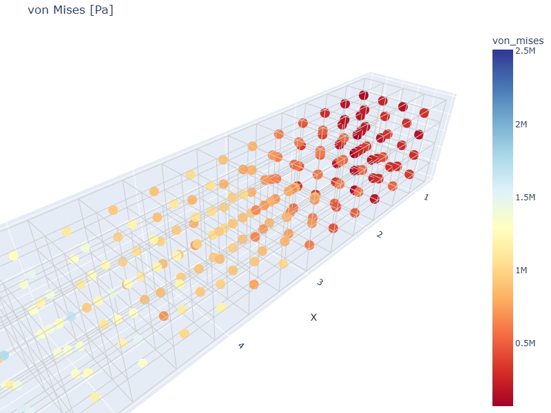

# CS04 — Lastra piana con foro (Kirsch)

## Caso di letteratura

Caso classico (Kirsch, 1898). Lastra piana "indefinita" (o grande
rispetto al foro) con un foro circolare centrale di raggio `a`,
soggetta a trazione lontana `sigma_0`. Lo stato tensionale in
coordinate polari:

$$
\sigma_{rr} = \frac{\sigma_0}{2}\left(1 - \frac{a^2}{r^2}\right)
            + \frac{\sigma_0}{2}\left(1 - \frac{4 a^2}{r^2} + \frac{3 a^4}{r^4}\right) \cos 2\theta
$$
$$
\sigma_{\theta\theta} = \frac{\sigma_0}{2}\left(1 + \frac{a^2}{r^2}\right)
                      - \frac{\sigma_0}{2}\left(1 + \frac{3 a^4}{r^4}\right) \cos 2\theta
$$

Al bordo del foro (`r = a`, `theta = 0`, punto piu' sollecitato):
`sigma_tt_max = 3 sigma_0`. Il fattore di concentrazione
delle tensioni vale `K_t = 3` per lastra infinita.

## Modello

Per simulare il caso con elementi esaedrici, modelliamo 1/4 del
dominio sfruttando la doppia simmetria (`y = 0` e `z = 0` come piani
di simmetria). Il dominio computazionale e':

```
[0, W] x [0, t] x [0, H]
```

Il foro circolare centrato in `(0, t/2, H/2)` di raggio `a` viene
ottenuto **rimuovendo** gli elementi il cui baricentro cade dentro
il cilindro. I nodi isolati risultanti vengono vincolati per evitare
moti rigidi (workaround necessario per la mesh esaedrica).

```python
m = build_cube_hex8_partial(...)  # cubo [0,W] x [0,t] x [0,H]
# Rimuovi elementi dentro al cilindro
for eid, el in m.elements.items():
    cx, cy, cz = el._coords().mean(axis=0)
    if cx**2 + (cy - t/2)**2 + (cz - H/2)**2 < a**2:
        del m.elements[eid]
# Vincola nodi isolati (sul bordo del foro)
# Simmetria su y=0, z=0
# Trazione sigma_0 sulla faccia x=W
```

## Mesh e deformata

| Mesh (1/4 dominio, foro visibile) | Deformata |
|-----------------------------------|-----------|
|  |  |

## Risultati e limiti

Il modello Hex8 su griglia rettangolare presenta **diversi limiti**
per questo caso:

1. Il foro circolare viene approssimato da una "scalettatura" di celle
   rettangolari, generando una mesh "a pixel" sul bordo
2. I nodi isolati sul bordo del foro (nei "buchi" lasciati dagli
   elementi rimossi) vengono vincolati, alterando il campo tensionale
3. La concentrazione di sforzo attorno al foro richiede mesh molto
   fini vicino al bordo

I risultati mostrano una concentrazione di sforzo al bordo del foro
nella direzione della trazione, ma quantitativamente il `K_t` calcolato
risulta molto inferiore al valore teorico di 3.

## Mappe di tensione

| sigma_yy | von Mises |
|----------|-----------|
|  |  |

Si osserva la concentrazione di tensione attorno al foro, anche se
il valore massimo e' attenuato dalla mesh coarse e dai vincoli
sui nodi del bordo.

## Per migliorare il modello

- Usare **mesh cilindriche native** (con elementi wedge o brick
  radiali) invece di una griglia rettangolare
- Aumentare la densita' di mesh vicino al bordo del foro
- Modellare il "tappo" del foro con elementi shell rigidi e applicare
  le condizioni di bordo corrette (sigma_rr = 0 sul bordo)

## Script

`casestudies/cs04_kirsch_plate.py`
