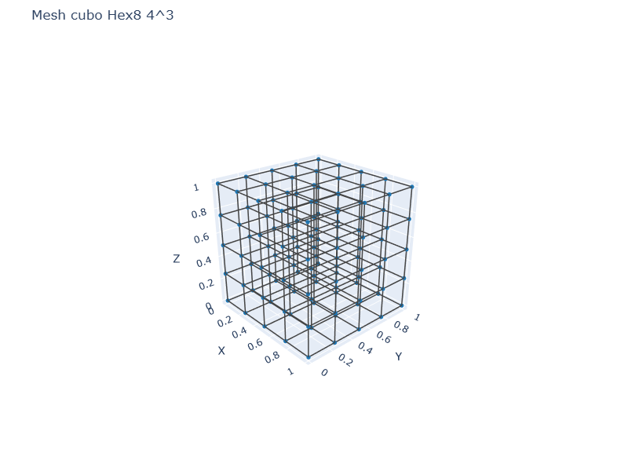
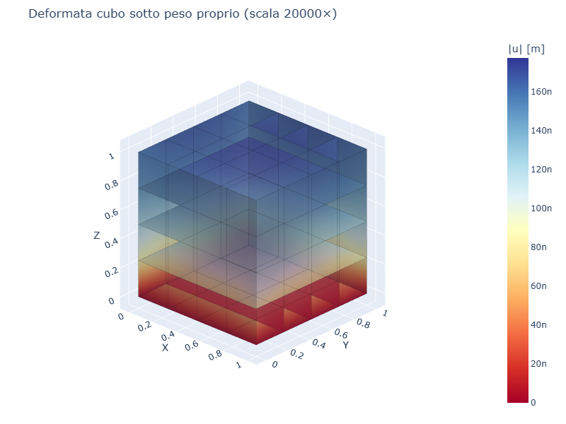
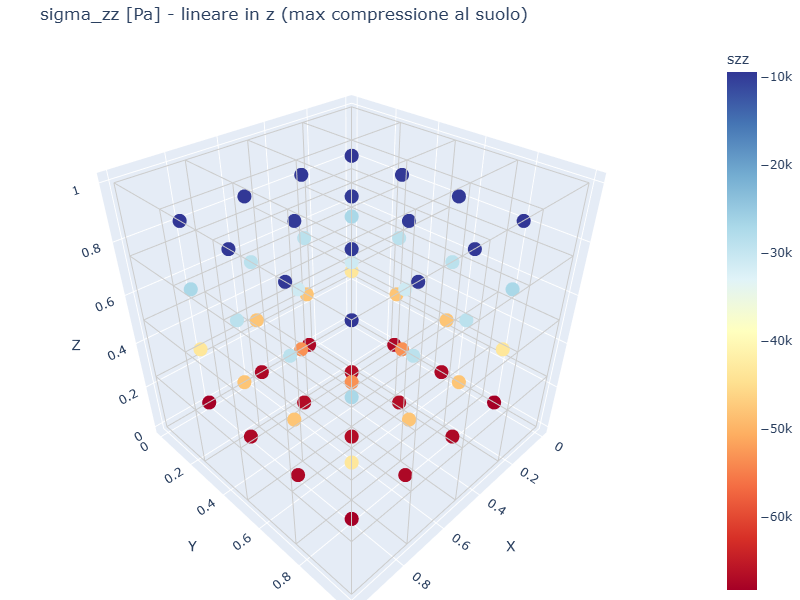
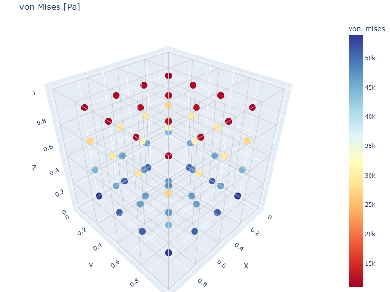

# CS05 — Cubo con peso proprio (body force / gravità)

## Caso di letteratura

Cubo [0,L]^3 soggetto alla forza di volume del peso proprio, con
densita' `rho` e accelerazione di gravita' `g` diretta in `-z`.

Soluzione esatta per compressione uniassiale con vincolo sulla faccia
inferiore (`z = 0` bloccata in tutte le direzioni):

$$
\sigma_{zz}(z) = -\rho g z \quad \text{(lineare in z)}
$$
$$
u_z(z) = -\frac{\rho g}{E} \cdot \frac{z^2}{2}
$$
$$
u_z(L) = -\frac{\rho g L^2}{2 E}
$$

## Modello

```python
mat = Material(E=210e9, nu=0.3, rho=7850.0)
m, bottom_ids, top_ids = build_cube_hex8(L, n, mat)

# Body force automatico dalla densita' del materiale
m.add_gravity(g=9.81, direction="z")

# Vincolo: faccia inferiore incastrata
for nid in bottom_ids:
    m.fix(nid, ["ux", "uy", "uz"])
```

## Mesh e deformata

| Mesh | Deformata (scala 20000×) |
|------|--------------------------|
|  |  |

## Convergenza FEM

| mesh    | u_z(L) FEM  | err % | sigma_zz(0) medio | err % |
|---------|-------------|-------|-------------------|-------|
| 2×2×2   | 1.74e-7     | 4.8%  | -5.78e+4          | 25%   |
| 4×4×4   | 1.78e-7     | 3.2%  | -6.74e+4          | 12.5% |
| 6×6×6   | 1.79e-7     | 2.6%  | -7.06e+4          | 8.3%  |
| 8×8×8   | 1.79e-7     | 2.3%  | -7.22e+4          | 6.3%  |

Lo spostamento u_z(L) converge rapidamente al valore esatto
(1.83e-7 m). La sigma_zz al suolo converge linearmente al valore
esatto -7.70e+4 Pa (rho*g*L).

## Mappe di tensione

| sigma_zz | von Mises |
|----------|-----------|
|  |  |

`sigma_zz` mostra la distribuzione lineare attesa, da 0 in alto
(superficie libera) a -rho*g*L al suolo. `von Mises` ha il valore
massimo al suolo e diminuisce linearmente verso l'alto.

## Casi applicativi

- **Strutture massive**: dighe, fondazioni, blocchi di ancoraggio
- **Geotecnica**: stima delle tensioni litostatiche nel sottosuolo
- **Strutture offshore**: piattaforme, zavorre,船体
- **Verifica sismica**: contributo del peso proprio alla massa
  sismica

## Script

`casestudies/cs05_body_force.py`
