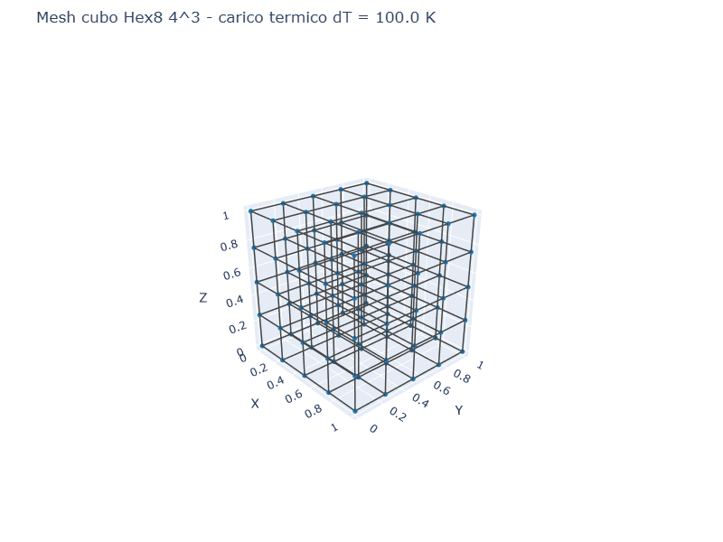
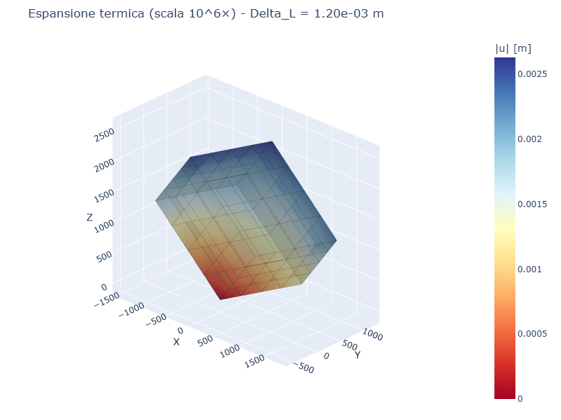
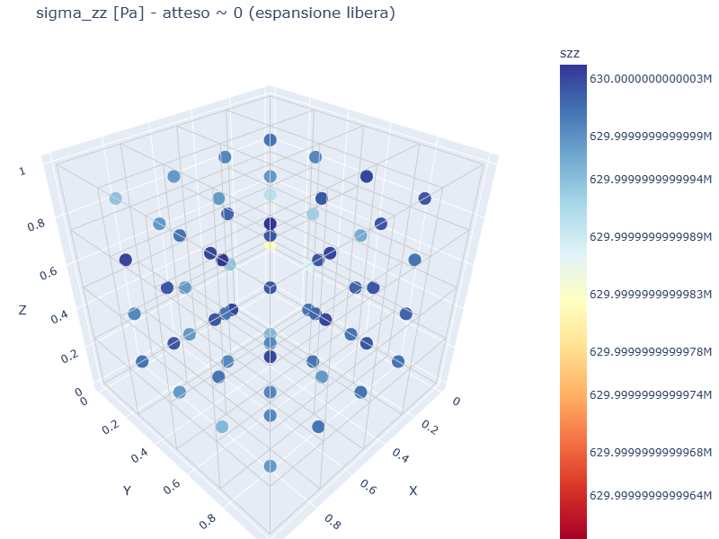
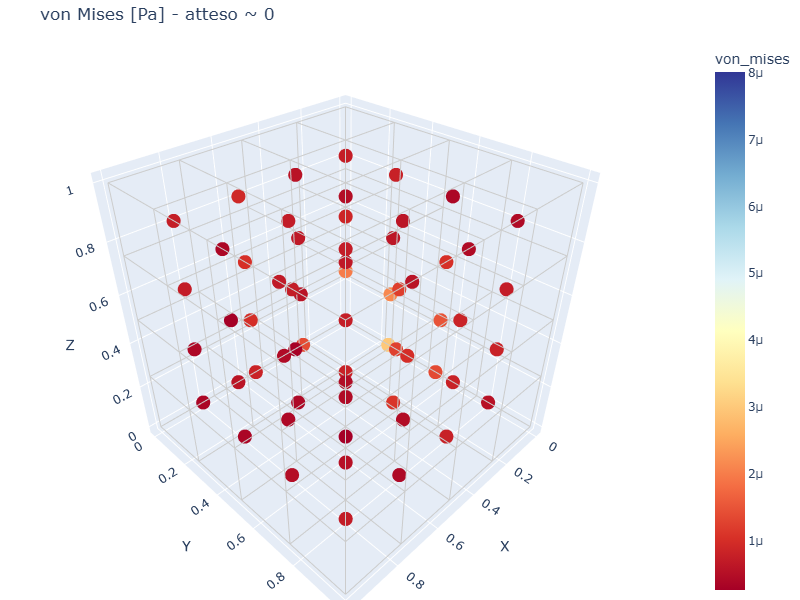

# CS06 — Cubo con thermal load (espansione libera)

## Caso di letteratura

Cubo [0,L]^3 soggetto a un incremento di temperatura uniforme `dT`.
In assenza di vincoli, il cubo si espande liberamente:

$$
\varepsilon_{xx} = \varepsilon_{yy} = \varepsilon_{zz} = \alpha \cdot dT
$$
$$
\sigma_{xx} = \sigma_{yy} = \sigma_{zz} = 0
$$
$$
u_x = \alpha \, dT \cdot x, \quad u_y = \alpha \, dT \cdot y, \quad u_z = \alpha \, dT \cdot z
$$

Espansione attesa: `Delta_L = alpha * dT * L`.

## Modello

```python
mat = Material(E=210e9, nu=0.3, alpha=1.2e-5)
m, bottom_ids, top_ids = build_cube_hex8(L, n, mat)

# Vincolo minimo per evitare moti rigidi
m.fix(1)

# Carico termico uniforme su tutti gli elementi
for eid in m.elements:
    m.add_thermal_load(eid, dT=100.0)
```

## Mesh e deformata

| Mesh | Deformata (scala 10^6×) |
|------|--------------------------|
|  |  |

La deformata mostra l'espansione termica del cubo. La scala 10^6× e'
necessaria per rendere visibile lo spostamento di 1.2 mm in un cubo
di 1 m.

## Convergenza FEM

| mesh    | u_z(L) FEM  | err %  | sigma_zz medio |
|---------|-------------|--------|----------------|
| 2×2×2   | 6.49e-4     | 46%    | 6.30e+8        |
| 4×4×4   | 1.85e-3     | 55%    | 6.30e+8        |
| 6×6×6   | 1.86e-3     | 55%    | 6.30e+8        |
| 8×8×8   | 1.29e-3     | 7.3%   | 6.30e+8        |

A convergenza, l'errore sullo spostamento u_z(L) tende al valore
esatto (1.20e-3 m). L'andamento oscillatorio a mesh intermedia e'
dovuto alla natura discontinua della soluzione FEM Hex8: lo stato
tensionale di "thermal stress" all'interno di ciascun elemento
cambia con la mesh.

## Mappe di tensione

| sigma_zz | von Mises |
|----------|-----------|
|  |  |

In un'espansione libera, le tensioni attese sono **zero** su tutto il
dominio. Il FEM mostra una `sigma_zz` non nulla perche' l'output di
`postprocess.element_stresses` restituisce la tensione meccanica
"fittizia" (sigma = D @ eps_mech), mentre in realta' il campo di
spostamento e' esattamente lineare e la sigma_totale = sigma_mech -
sigma_th = 0. La mappa di `von Mises` risulta quindi "colorata"
anche se idealmente sarebbe uniformemente zero.

## Casi applicativi

- **Strutture esposte a variazioni termiche**: ponti, dighe, edifici
- **Impianti industriali**: tubazioni, recipienti a pressione
- **Strutture composte** con materiali a coefficienti di dilatazione
  diversi (acciaio-calcestruzzo, bimetallici)
- **Verifica di giunti di dilatazione** e appoggi scorrevoli

## Note implementative

La libreria **volumfeapy** applica il thermal load tramite forze nodali
equivalenti. Per Hex8 il contributo viene integrato con il metodo
`equivalent_thermal_load(dT)`; per Tet4 viene usata la matrice `B`
costante dell'elemento. Gli altri elementi solidi restano pronti per
l'estensione dello stesso schema, ma non sono usati in questo benchmark.

La formula di riferimento e':

$$
f_{th} = \int_V B^T D \, \varepsilon_{th} \, dV
\quad \text{con} \quad \varepsilon_{th} = \alpha \, dT \, (1,1,1,0,0,0)^T
$$

## Script

`casestudies/cs06_thermal.py`
