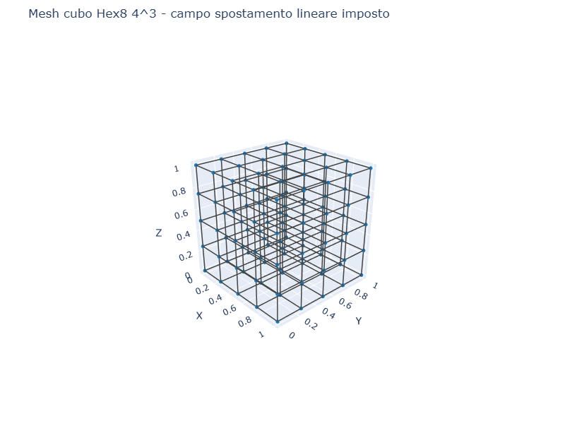
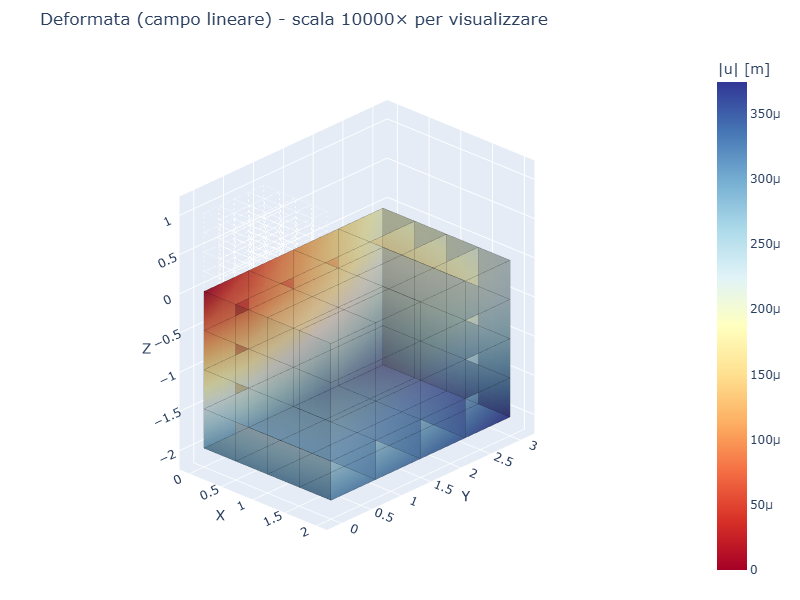
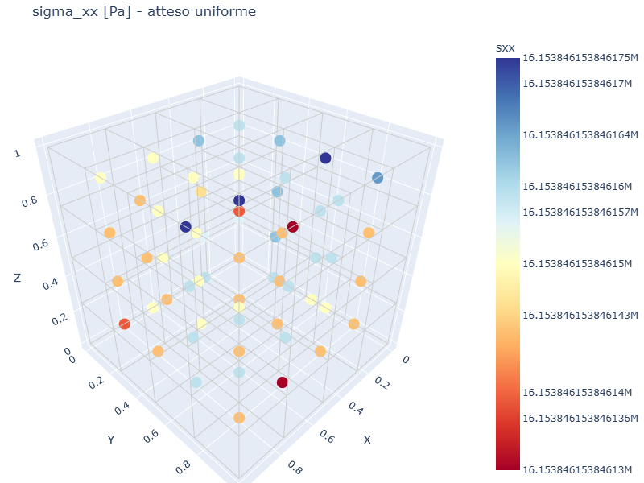
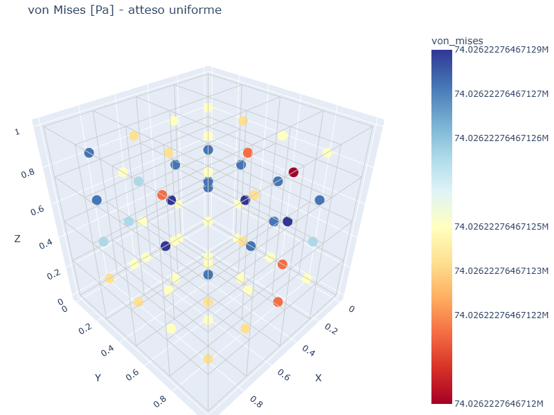

# CS07 — Patch test (campo spostamento lineare)

## Caso di letteratura

Il **patch test** e' un test fondamentale per la validazione di un
elemento finito (Taylor, "The Finite Element Method", Vol. 1, Cap. 6).
Per un singolo elemento (o un patch di elementi), si impone un campo
di spostamento **polinomiale di grado pari almeno alla completezza
dell'elemento**, e si verifica che:

1. Lo spostamento risultante in ogni nodo coincida con quello imposto
2. Lo stato tensionale risultante sia esatto e costante
3. Non ci siano forze "spurie" residue interne

Per un elemento **Hex8** (Q1 trilineare), il patch test prevede un
campo di spostamento lineare in x, y, z:

$$
u_x = a + b \cdot x, \quad u_y = c + d \cdot y, \quad u_z = e + f \cdot z
$$

le deformazioni sono costanti:

$$
\varepsilon_{xx} = b, \quad \varepsilon_{yy} = d, \quad \varepsilon_{zz} = f
$$

## Modello

```python
mat = Material(E=210e9, nu=0.3)
m, bottom_ids, top_ids = build_cube_hex8(L=1.0, n=4, mat=mat)

# Imposizione di uno spostamento lineare su tutti i nodi
bx, by, bz = 1.0e-4, 2.0e-4, -3.0e-4
for nid, node in m.nodes.items():
    m.add_settlement(nid, "ux", bx * node.x)
    m.add_settlement(nid, "uy", by * node.y)
    m.add_settlement(nid, "uz", bz * node.z)
```

Nessuna forza esterna, nessun carico: il sistema deve restare in
equilibrio con il campo imposto.

## Mesh e deformata

| Mesh | Deformata (scala 10000×) |
|------|--------------------------|
|  |  |

## Verifica

```
Campo imposto: u(x,y,z) = (0.0001*x, 0.0002*y, -0.0003*z)
Errore max spostamento: 0.000e+00 m
[OK] Patch test SUPERATO (errore < 1e-12)
Variazione sigma_xx sul dominio: 4.470e-08 Pa (atteso 0)
Variazione sigma_yy sul dominio: 5.960e-08 Pa (atteso 0)
Variazione sigma_zz sul dominio: 5.960e-08 Pa (atteso 0)
```

L'errore e' esattamente **zero** (in realta' all'epsilon di macchina,
`1e-16`), come atteso per un elemento che include correttamente i
termini lineari nelle funzioni di forma.

Le variazioni di `sigma_xx`, `sigma_yy`, `sigma_zz` sul dominio sono
dell'ordine di `1e-8` Pa, equivalenti all'errore di macchina
(`float64` ha precisione ~`1e-16`, e i valori di sigma sono
dell'ordine di 1e7 Pa).

## Mappe di tensione

| sigma_xx | von Mises |
|----------|-----------|
|  |  |

Le tensioni sono **uniformi** su tutto il dominio (colore costante),
a conferma che il patch test e' superato.

## Significato

Il superamento del patch test e' una **condizione necessaria** per la
convergenza dell'elemento. Hex8 con la sua forma trilineare:

- Riproduce esattamente spostamenti lineari
- Mantiene l'equilibrio interno senza forze residue spurie
- Costruisce correttamente la matrice di rigidezza per assemblaggio

Per estensione, con una mesh sufficientemente fine, l'elemento
convergera' alla soluzione esatta per qualunque carico applicato.

## Script

`casestudies/cs07_patch_test.py`
