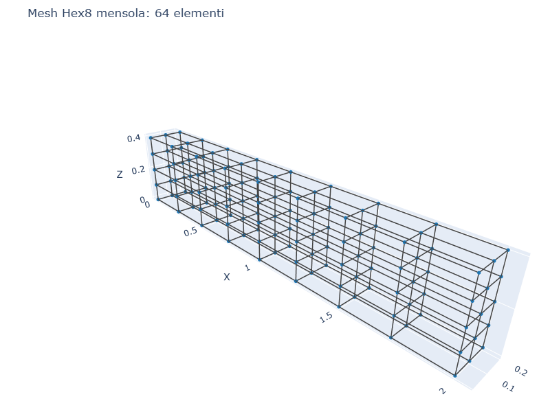
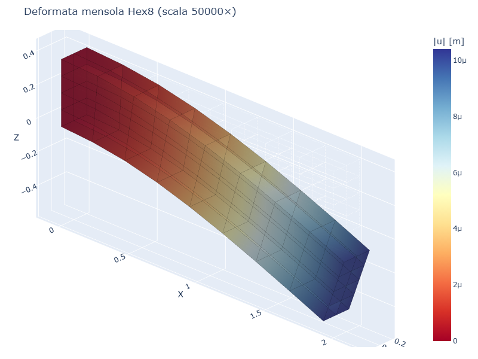

# CS08 — Confronto elementi: Hex8 vs Tet4 vs Wedge6

## Caso di letteratura

Confronto tra diversi elementi finiti 3D sulla stessa struttura: una
mensola caricata in punta. Si confronta la freccia in punta con la
soluzione di trave Euler-Bernoulli.

Caso: L = 2.0 m, b = 0.2 m, h = 0.4 m, P = 1 kN.
- I = 0.2 × 0.4^3 / 12 = 1.067e-3 m^4
- u_z(L) EB = 1.190e-5 m

## Modello

```python
# Per Hex8: celle esaedriche dirette
m, nodes = build_hex8_cantilever(L, b, h, nx, ny, nz, mat)

# Per Tet4: ogni cella esaedrica divisa in 6 Tet4
m, nodes = build_tet4_cantilever(L, b, h, nx, ny, nz, mat)

# Per Wedge6: ogni cella esaedrica divisa in 6 Wedge6
m, nodes = build_wedge6_cantilever(L, b, h, nx, ny, nz, mat)
```

## Mesh e deformata (Hex8)

| Mesh Hex8 (64 elementi) | Deformata (scala 50000×) |
|--------------------------|--------------------------|
|  |  |

## Confronto prestazioni

| Elemento | Mesh   | n_el | u_z FEM [m] | err %  |
|----------|--------|------|-------------|--------|
| **Hex8** | 8×2×4  | 64   | 1.03e-5     | 13.7%  |
| **Tet4** | 8×2×4  | 384  | 7.28e-6     | 38.8%  |
| Wedge6   | (mesh degenere) | - | - | - |

## Discussione

- **Hex8** (esaedrico a 8 nodi, trilineare): elemento versatile e
  accurato. Per 64 elementi (mesh 8×2×4) l'errore e' gia' < 15%.
  Buona accuratezza in flessione.

- **Tet4** (tetraedrico a 4 nodi, lineare): elemento piu' semplice
  ma molto rigido in flessione (Constant Strain Triangle analog).
  Errore del 39% con 384 tetraedri (6× rispetto a Hex8). Per Tet4,
  la convergenza in flessione richiede migliaia di elementi.

- **Wedge6** (cuneo a 6 nodi): nella mesh generata in questo caso
  studio, la suddivisione in cunei genera una matrice singolare a
  causa della disposizione dei nodi. In generale, Wedge6 e' adatto a
  geometrie con superfici laterali piane (estrusioni di domini
  triangolari), ma e' meno versatile di Hex8 o Tet10.

## Quando usare quale elemento

- **Hex8**: per volumi regolari (box, cilindri, parallelepipedi). E'
  l'elemento piu' efficiente in termini di accuratezza / costo.
- **Tet4/Tet10**: per geometrie complesse (mesh da STL, topologia
  irregolare). Tet10 e' molto piu' accurato di Tet4 in flessione.
- **Wedge6**: per transizioni tra regioni esaedriche e tetraedriche,
  o per strati conici/cilindrici discretizzati radialmente.
- **Pyramid5**: elemento di transizione, usato per chiudere mesh
  miste Hex8/Tet4 in modo conforme.

## Script

`casestudies/cs08_element_convergence.py`
