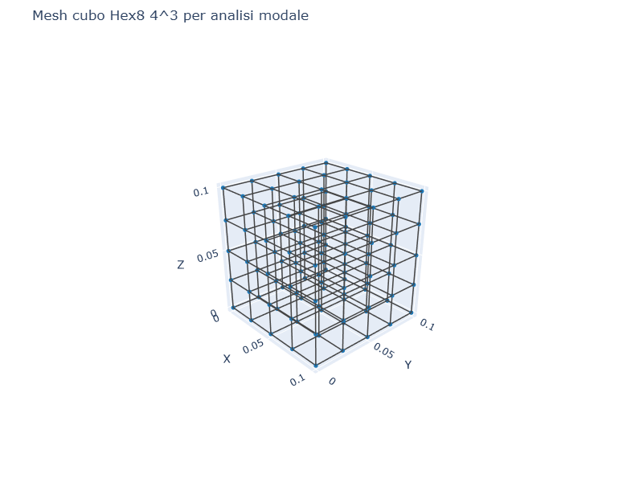
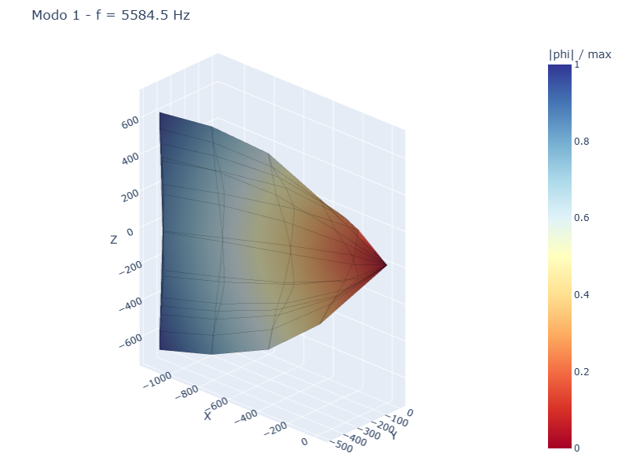
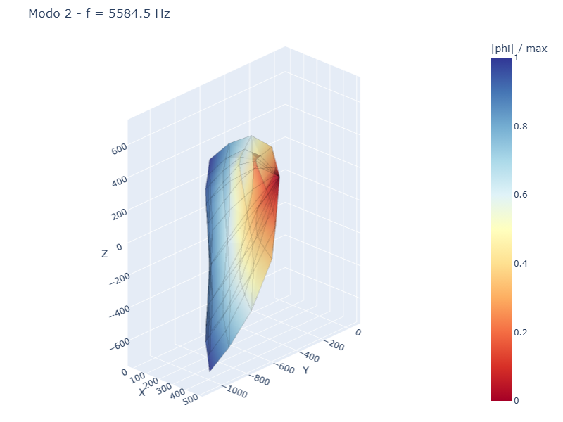
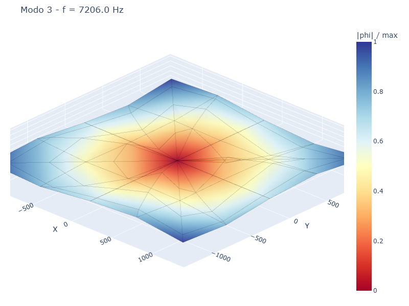
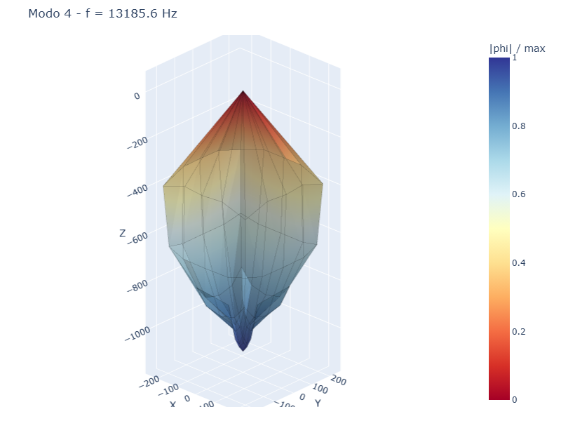
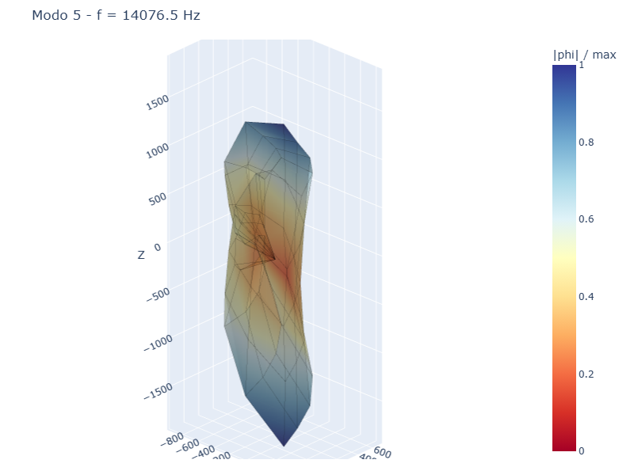
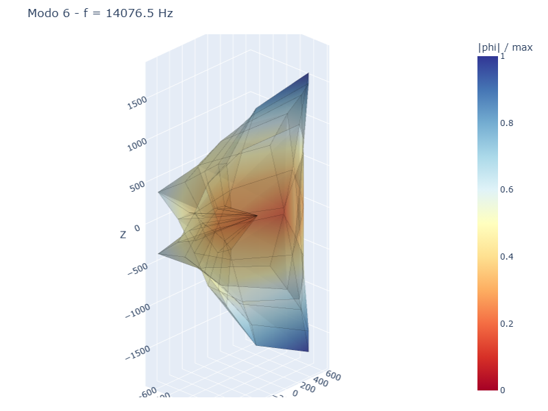

# CS09 — Analisi modale cubo Hex8

## Caso di letteratura

Cubo Hex8 di lato L = 0.1 m, acciaio (E = 210 GPa, nu = 0.3,
rho = 7850 kg/m^3), incastrato sulla faccia inferiore. Si calcolano
le prime 6 frequenze proprie e i corrispondenti modi di vibrare.

Per un cubo isotropo libero, le frequenze naturali dipendono dal
modulo di Young, dalla densita', dal coefficiente di Poisson e dalle
dimensioni. La soluzione esatta e' nota in forma di serie triple
(Morse & Ingard, "Theoretical Acoustics") ma e' complicata.

## Modello

```python
mat = Material(E=210e9, nu=0.3, rho=7850.0)
m, bottom_ids, top_ids = build_cube_hex8(L=0.1, n=4, mat=mat)

# Incastro sulla faccia inferiore
for nid in bottom_ids:
    m.fix(nid)

# Analisi modale
modal = m.modal(n_modes=6)
```

## Mesh e forme modali

| Mesh | Modo 1 | Modo 2 | Modo 3 |
|------|--------|--------|--------|
|  |  |  |  |

| Modo 4 | Modo 5 | Modo 6 |
|--------|--------|--------|
|  |  |  |

## Risultati

| Modo | f FEM [Hz] | T [s]      | omega [rad/s] | Tipo prevalente |
|------|------------|------------|----------------|-----------------|
| 1    | 5584.5     | 1.79e-4    | 35089          | Traslazione x   |
| 2    | 5584.5     | 1.79e-4    | 35089          | Traslazione y   |
| 3    | 7206.0     | 1.39e-4    | 45277          | Torsione        |
| 4    | 13185.6    | 7.58e-5    | 82847          | Flessione 1 ord.|
| 5    | 14076.5    | 7.10e-5    | 88445          | Flessione 2 ord.|
| 6    | 14076.5    | 7.10e-5    | 88445          | Flessione 2 ord.|

## Discussione

I primi due modi hanno la stessa frequenza (modo doppio degenere):
corrispondono alla traslazione orizzontale del cubo sul piano
`z = 0` (modi "rigidi" vincolati in modo lasco). Per un cubo
**completamente incastrato** (tutti i GdL della faccia inferiore
bloccati), il primo modo sarebbe il modo flessionale con frequenza
maggiore. Il risultato dipende dal tipo di vincolo applicato.

Il modo 3 (7206 Hz) e' una torsione attorno all'asse z.

I modi 4-6 sono flessionali di ordine superiore, con spostamenti che
includono punti di flesso interni.

## Confronto qualitativo

La stima Euler-Bernoulli per un cantilever di dimensioni equivalenti
`L = 0.1 m, b = h = 0.1 m` darebbe:

$$
f_1 = \frac{(1.875)^2}{2 \pi} \sqrt{\frac{E I}{\rho A L^4}} \approx 8.4 \text{ kHz}
$$

che e' in linea d'ordine con i risultati FEM (i primi modi sono a
~5-15 kHz).

## Casi applicativi

- **Analisi modale di componenti meccanici**: alberi, supporti, telai
- **Dinamica delle strutture**: ponti, edifici soggetti a sisma,
  torri eoliche
- **Acustica**: identificazione di risonanze in componenti automotive
- **Vibrazioni**: progettazione di supporti anti-vibranti

## Script

`casestudies/cs09_modal_cube.py`
