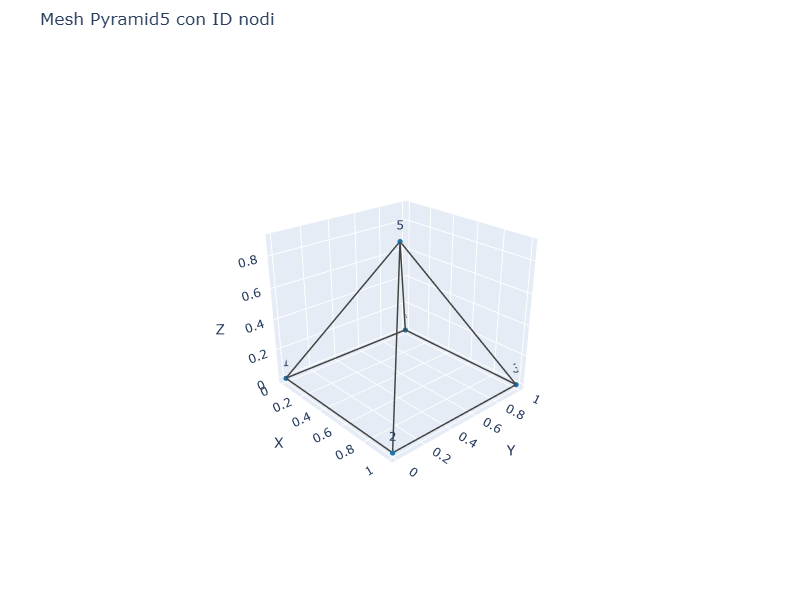
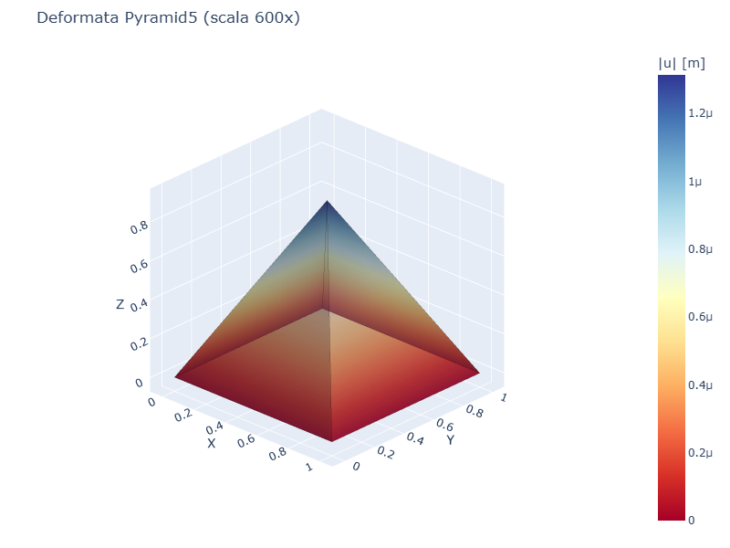
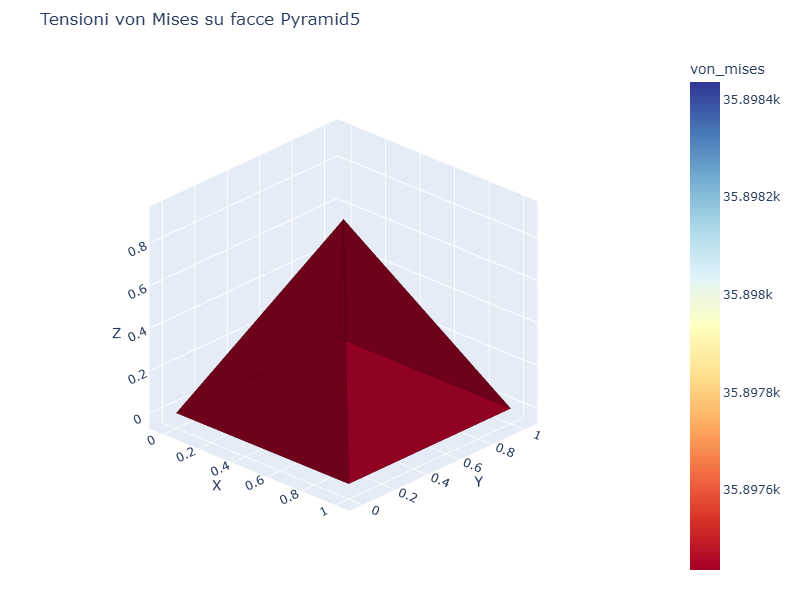
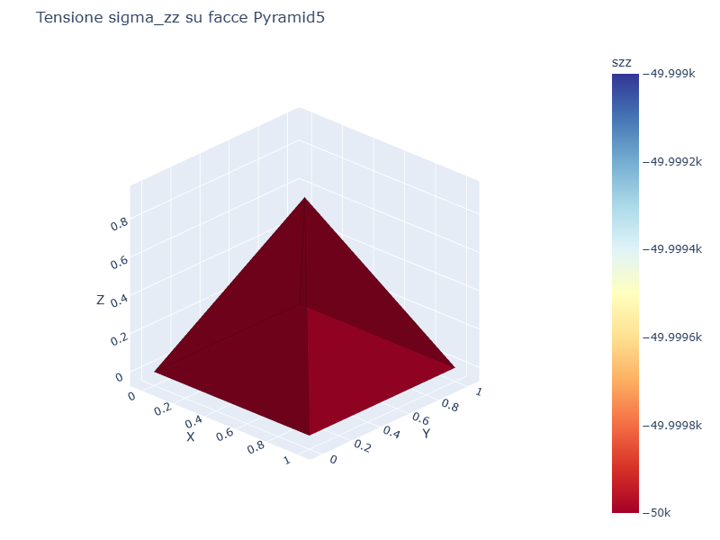

# CS10 - Elemento piramidale Pyramid5

## Obiettivo

Questo esempio mostra esplicitamente l'elemento **Pyramid5**, utile nelle
mesh miste come elemento di transizione tra zone esaedriche e tetraedriche.
La base quadrata e' completamente vincolata, mentre l'apice riceve un carico
verticale concentrato.

Il caso non vuole essere un benchmark analitico, ma un esempio operativo:
controlla che l'elemento possa essere assemblato, risolto, deformato e
visualizzato con la nuova mappa tensionale interpolata sulle facce.

## Modello

```python
from volumfeapy import Material, Model

mat = Material(E=30e9, nu=0.22)
m = Model()
m.add_node(1, 0.0, 0.0, 0.0)
m.add_node(2, 1.0, 0.0, 0.0)
m.add_node(3, 1.0, 1.0, 0.0)
m.add_node(4, 0.0, 1.0, 0.0)
m.add_node(5, 0.5, 0.5, 0.9)
m.add_pyramid5(1, [1, 2, 3, 4, 5], mat)

for nid in [1, 2, 3, 4]:
    m.fix(nid)
m.add_nodal_load(5, Fz=-50_000.0)
res = m.solve()
```

## Visualizzazione

| Mesh Pyramid5 | Deformata |
|----------------|-----------|
|  |  |

| von Mises | sigma_zz |
|-----------|----------|
|  |  |

Le tensioni sono disegnate sulle facce esterne dell'elemento. Il parametro
`subdivisions=8` raffina solo il contour grafico: la legenda resta nei valori
reali di tensione.

## Risultati

| Grandezza | Valore |
|-----------|--------|
| Volume elemento | 1.5000e-01 m3 |
| Spostamento verticale apice | -1.3138e-06 m |
| von Mises elemento | 3.5897e+04 Pa |

## Script

`casestudies/cs10_pyramid_element.py`
