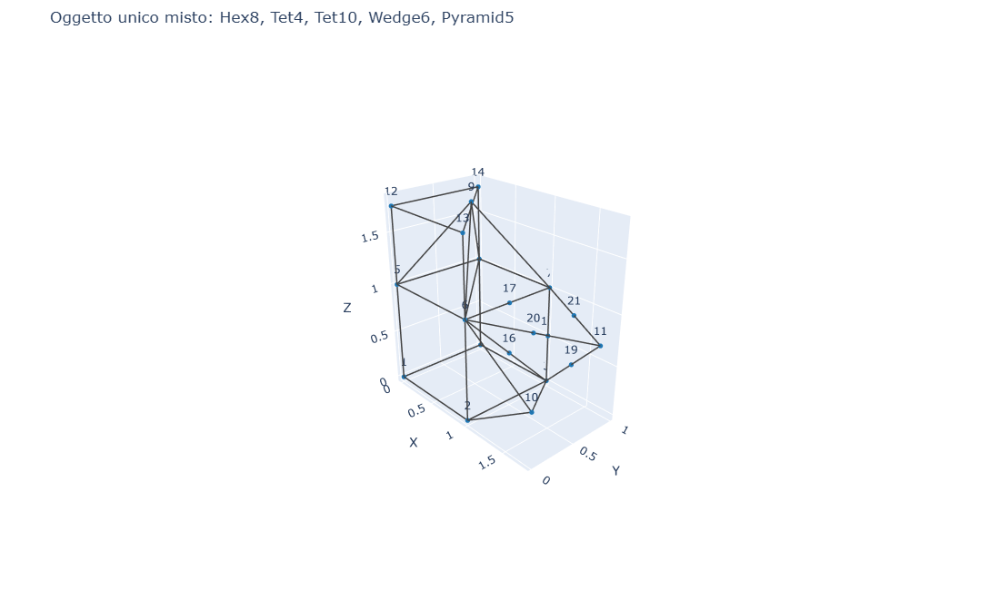
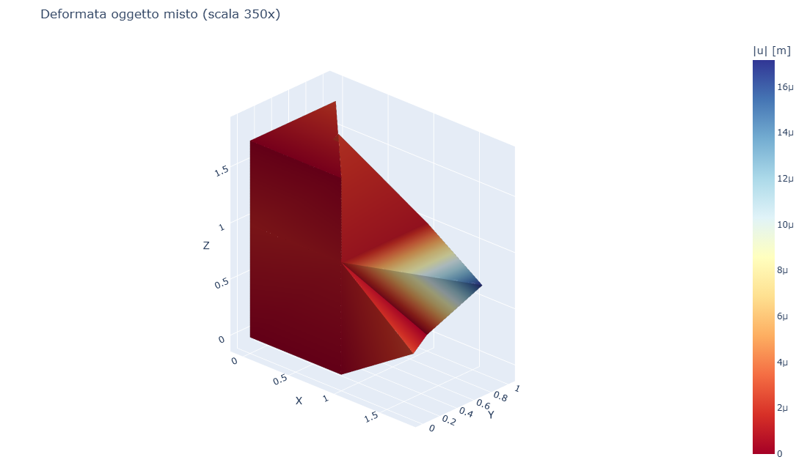
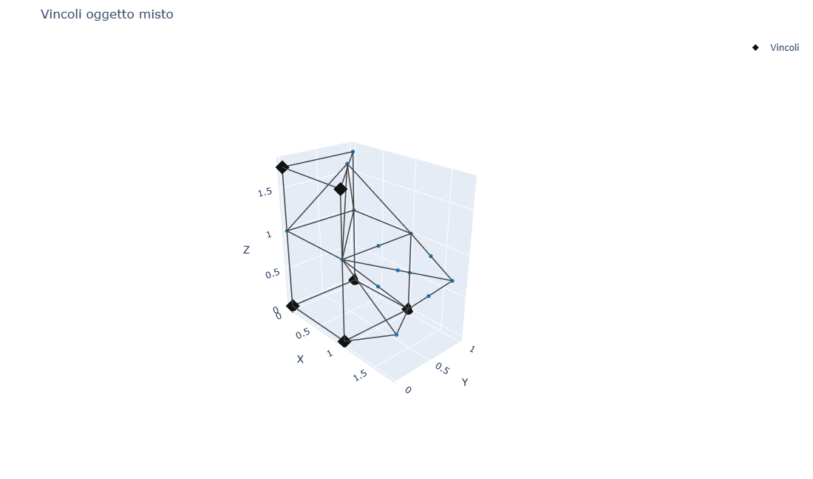
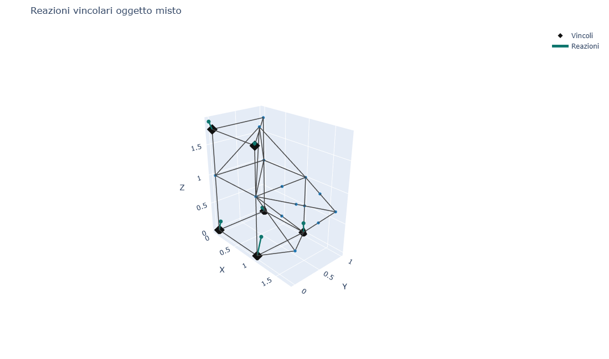
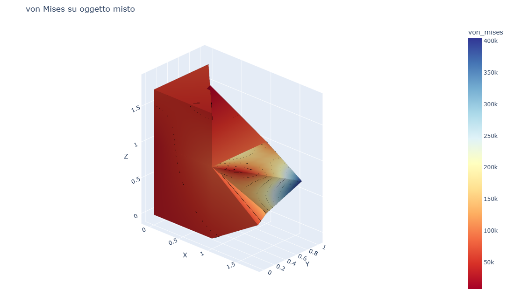
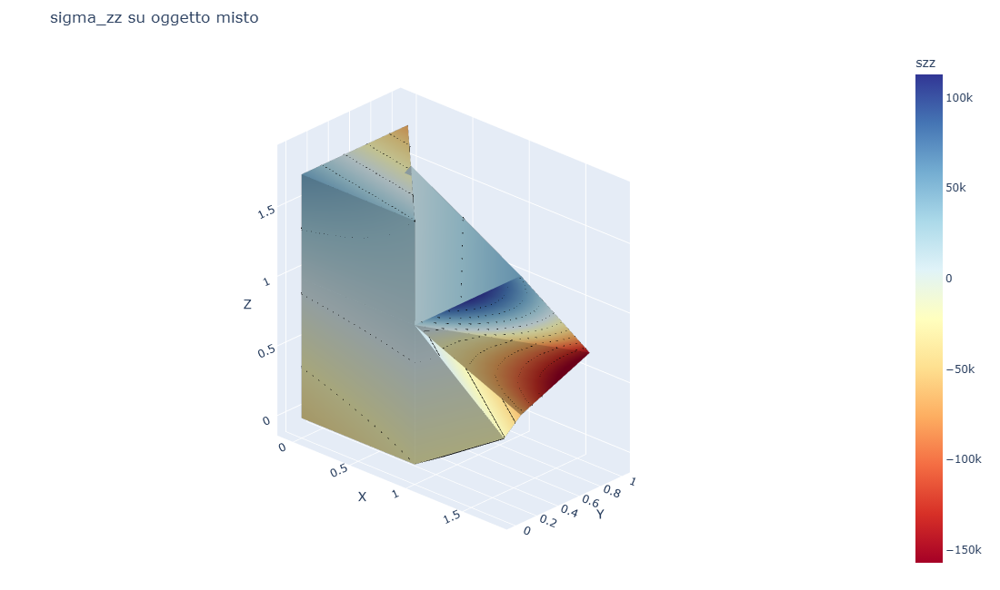

# CS11 - Tutti gli elementi volumetrici in un unico oggetto

## Obiettivo

Questo caso studio costruisce un unico corpo con tutti gli elementi volumetrici
implementati in **volumfeapy**:

- **Hex8**
- **Tet4**
- **Tet10**
- **Wedge6**
- **Pyramid5**

Il modello non e' una collezione di provini separati: Hex8, Pyramid5, Tet4,
Tet10 e Wedge6 condividono nodi o facce del nucleo e vengono assemblati nella
stessa matrice globale. Il caso e' volutamente compatto per rendere leggibile
la connessione tra elementi diversi, i vincoli e le reazioni vincolari.

## Visualizzazione

| Mesh mista | Deformata |
|------------|-----------|
|  |  |

| Vincoli | Reazioni |
|---------|----------|
|  |  |

| von Mises | sigma_zz |
|-----------|----------|
|  |  |

Il contour tensionale usa i valori nodali recuperati e li interpola sulle facce
esterne. Per Tet10 vengono usati anche i nodi intermedi della faccia, quindi il
plot segue la logica quadratica dell'elemento. Le iso-linee aiutano a leggere
le fasce di tensione anche quando la superficie non e' trasparente.

## Modello

```python
from volumfeapy import Material, Model

mat = Material(E=30e9, nu=0.22)
m = Model()

m.add_hex8(...)
m.add_pyramid5(...)
m.add_tet4(...)
m.add_tet10(...)
m.add_wedge6(...)

# Il corpo misto ha vincoli su nodi di base e carichi verticali distribuiti
# sui nodi caratteristici dei diversi elementi.
res = m.solve()
```

## Risultati

| Elemento | Nodi | Volume [m3] | max \|u\| [m] | von Mises [Pa] |
|----------|------|-------------|---------------|----------------|
| Hex8 | 8 | 1.0000e+00 | 1.2609e-06 | 2.3659e+04 |
| Pyramid5 | 5 | 1.3333e-01 | 2.1629e-06 | 7.9399e+03 |
| Tet4 | 4 | 1.0833e-01 | 2.4485e-06 | 6.6212e+04 |
| Tet10 | 10 | 1.2500e-01 | 1.7158e-05 | 6.9365e+04 |
| Wedge6 | 6 | 3.7500e-01 | 2.2942e-06 | 7.7059e+03 |

## Script

`casestudies/cs11_mixed_elements.py`
