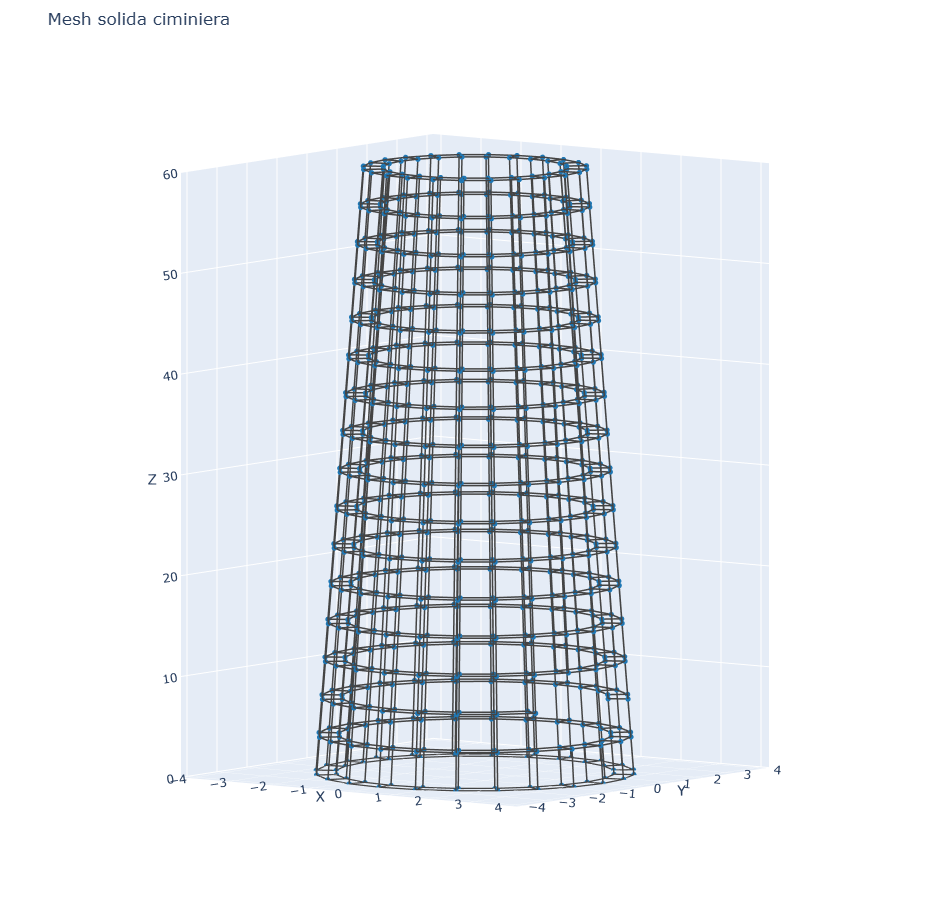
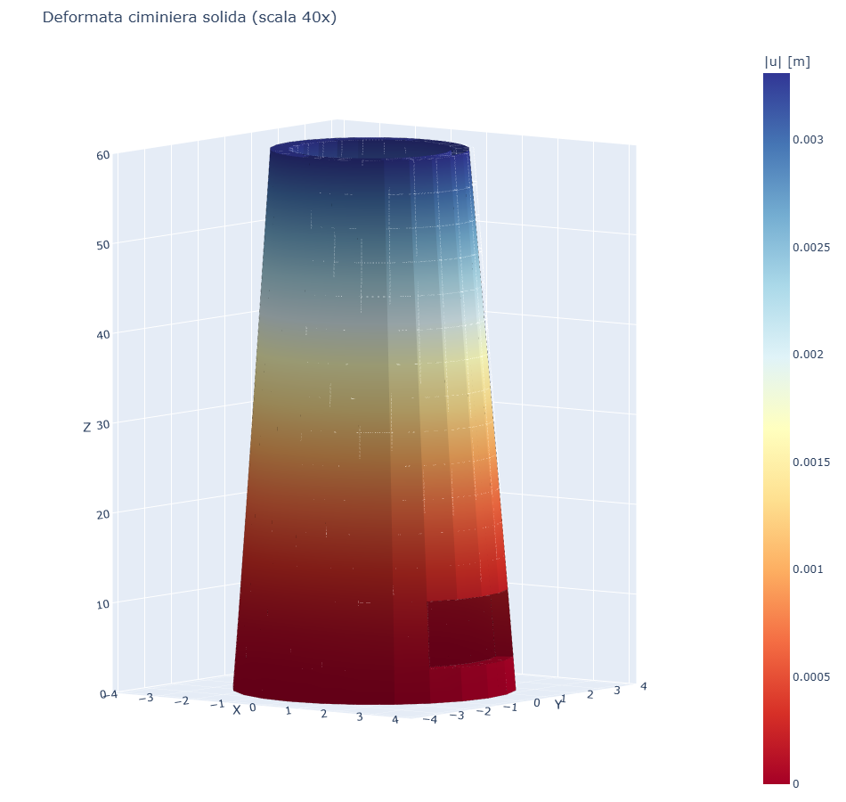
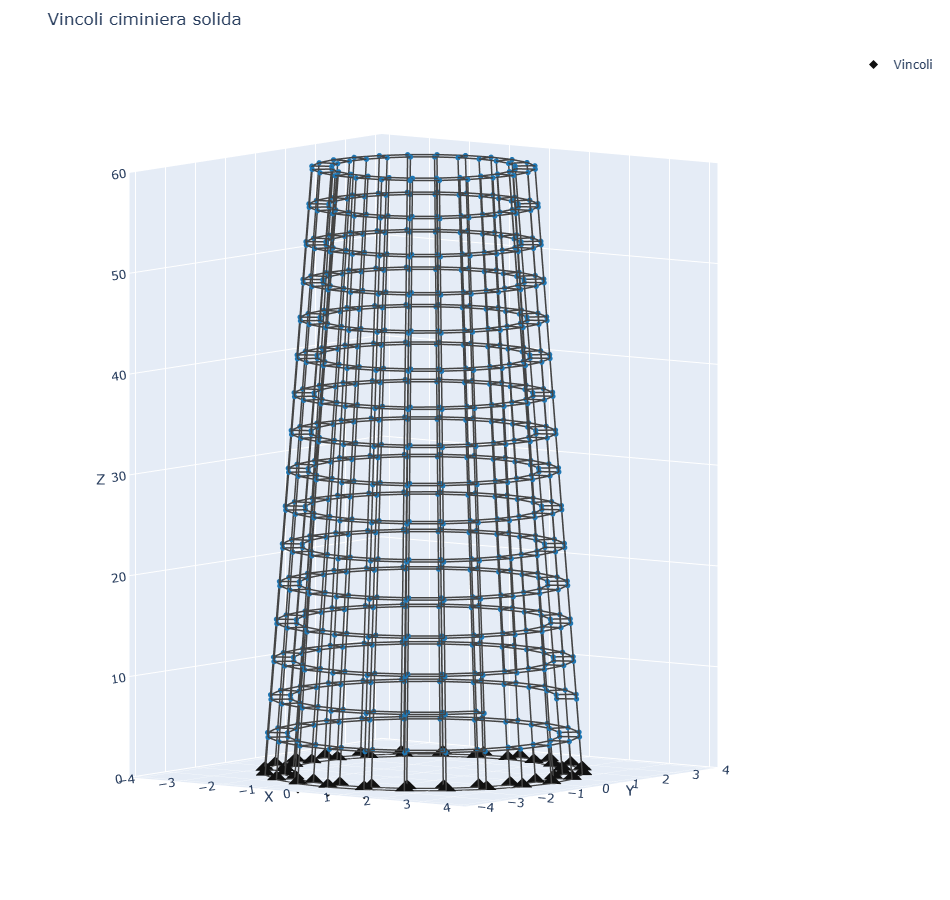
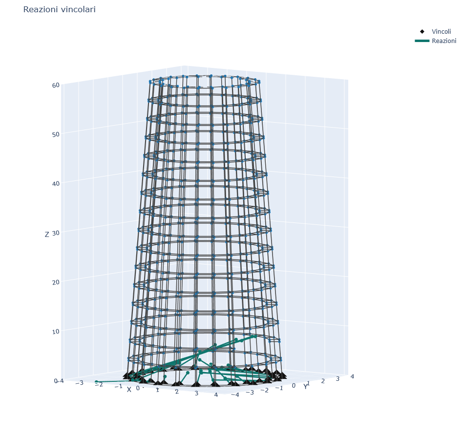
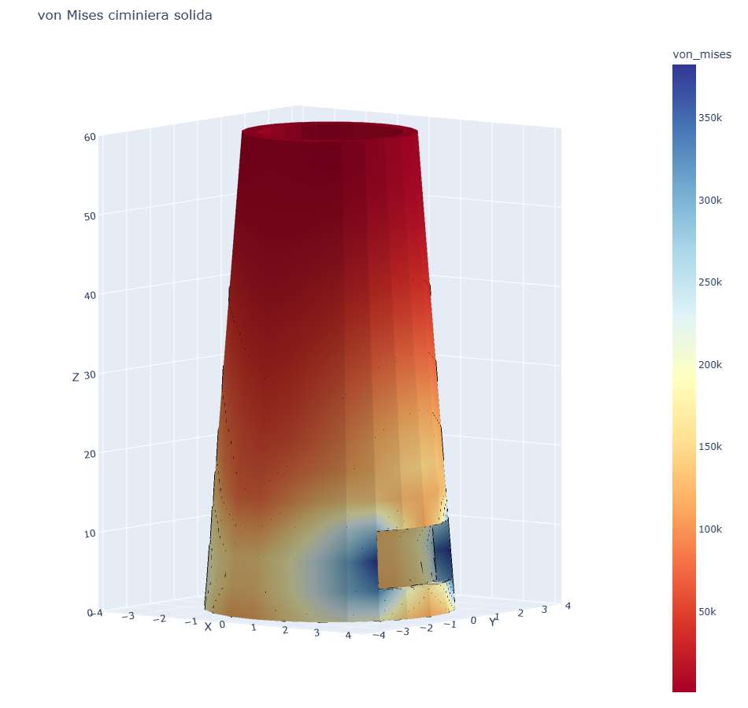
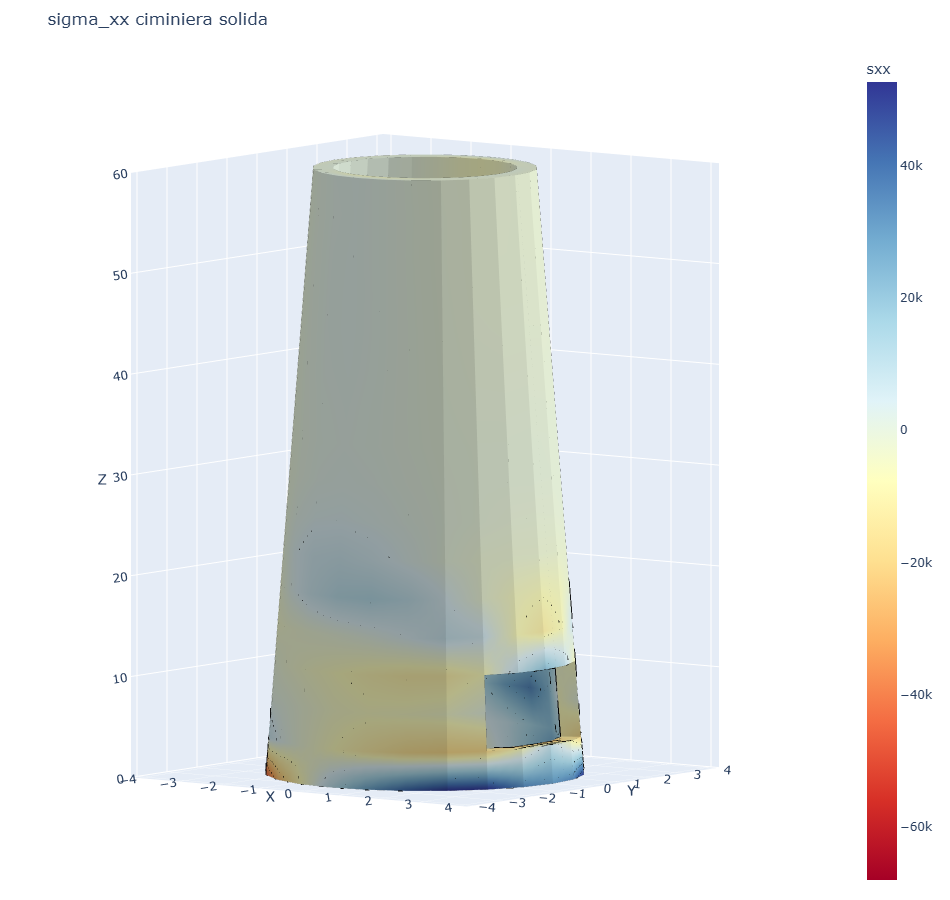

# CS12 - Ciminiera solida rastremata con apertura

## Obiettivo

Questo caso studio modella una ciminiera in cemento armato come fusto solido
cilindrico rastremato con elementi **Hex8**. La geometria e' la stessa del caso
CS13 di platefeapy:

- altezza `H = 60 m`;
- raggio medio alla base `3.00 m`;
- raggio medio in sommita' `2.05 m`;
- spessore `0.40 m`;
- apertura di servizio alla base;
- bordo inferiore incastrato;
- vento variabile in altezza e lungo la circonferenza.

Il carico del vento viene trasformato in forze nodali equivalenti sui nodi della
superficie esterna. La mappa delle tensioni viene visualizzata sulle facce della
mesh, con gradiente interpolato dai nodi degli elementi.

## Modello

```python
m, meta = build_chimney_solid(ntheta=24, nz=16)
res = m.solve()
```

| Grandezza | Valore |
|-----------|--------|
| Elementi Hex8 | 376 |
| Nodi | 810 |
| max \|u_radiale\| | 3.3069e-03 m |
| max \|u\| | 3.3120e-03 m |
| max von Mises | 3.1793e+05 Pa |
| Equilibrio `R_x + F_x` | 2.8709e-07 N |

## Visualizzazione

| Mesh | Deformata |
|------|-----------|
|  |  |

La deformata e' amplificata solo nella geometria visualizzata; la legenda usa
sempre gli spostamenti reali.

| Vincoli | Reazioni |
|---------|----------|
|  |  |

| von Mises su facce | sigma_xx su facce |
|--------------------|-------------------|
|  |  |

## Confronto con platefeapy

Il caso platefeapy CS13 usa gli stessi parametri geometrici e la stessa legge di
vento, ma discretizza la superficie media con elementi shell Q4 in coordinate
3D reali.

| Modello | Geometria | Elementi | Nodi | Spostamento di confronto |
|---------|-----------|----------|------|--------------------------|
| platefeapy CS13 | shell Q4 su superficie 3D reale | 752 | 783 | max \|u_radiale\| = 3.4867e-03 m |
| volumfeapy CS12 | solido Hex8 con spessore reale | 376 | 810 | max \|u_radiale\| = 3.3069e-03 m |

Lo scarto sul massimo spostamento radiale e' circa **5.4%**. Il confronto e'
quindi tra due modelli della stessa geometria reale: shell di superficie media
da un lato e solido con spessore discretizzato dall'altro.

## Script

`casestudies/cs12_chimney.py`
