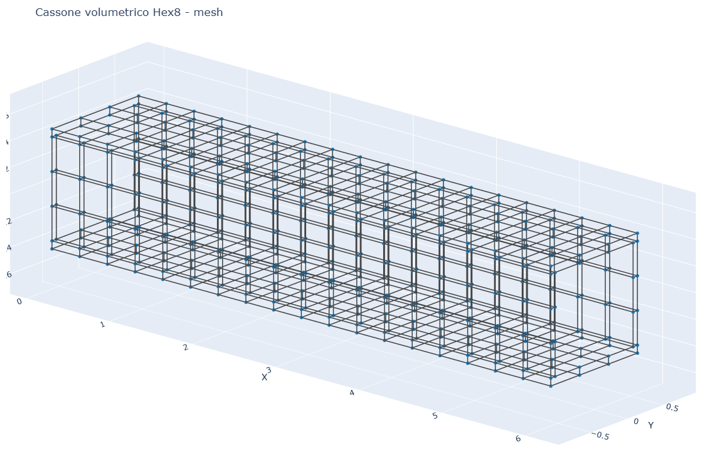
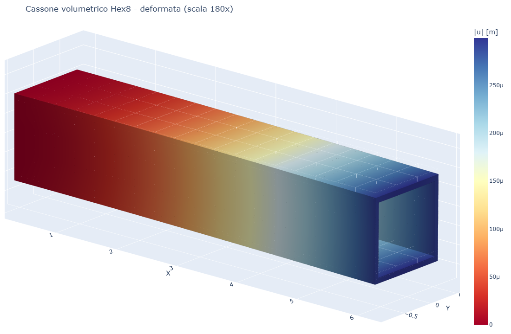
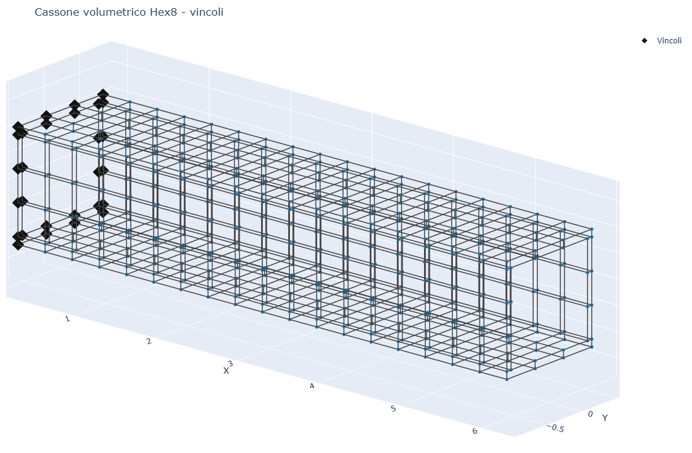
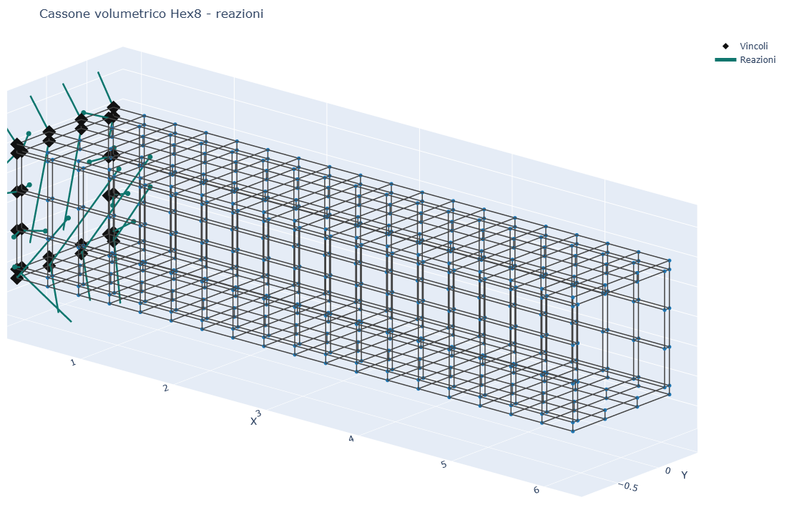
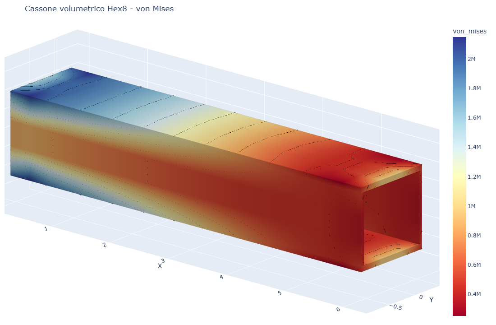

# CS13 - Cassone sottile volumetrico Hex8 a mensola

## Obiettivo

Questo caso studio modella una trave cassone rettangolare sottile con elementi
solidi **Hex8**. Le pareti del cassone hanno spessore reale: soletta superiore,
soletta inferiore e due anime laterali.

Il caso e' il gemello volumetrico di **platefeapy CS14**, che usa elementi
shell Q4 sulla superficie media.

## Modello

```python
m, meta = build_box_girder_solid(nx=18, n_width=3, n_height=3)
res = m.solve()
```

| Grandezza | Valore |
|-----------|--------|
| Lunghezza | 6.00 m |
| Larghezza | 1.20 m |
| Altezza | 0.90 m |
| Spessore | 0.060 m |
| Elementi Hex8 | 216 |
| Nodi | 532 |
| Carico in punta | -25.0 kN |
| w medio in punta | -2.9368e-04 m |
| max von Mises | 1.8606e+06 Pa |

## Visualizzazione

| Mesh solida | Deformata |
|-------------|-----------|
|  |  |

| Vincoli | Reazioni |
|---------|----------|
|  |  |

| von Mises |
|-----------|
|  |

## Confronto con platefeapy

| Modello | Idealizzazione | Elementi | Nodi | w medio in punta |
|---------|----------------|----------|------|------------------|
| platefeapy CS14 | shell Q4 su superficie media | 216 | 228 | -2.5958e-04 m |
| volumfeapy CS13 | pareti Hex8 con spessore reale | 216 | 532 | -2.9368e-04 m |

Lo scarto e' circa **11.6%**. Il confronto e' utile per verificare che i due
solutori leggano la stessa geometria strutturale con idealizzazioni diverse.

## Script

`casestudies/cs13_box_girder.py`
