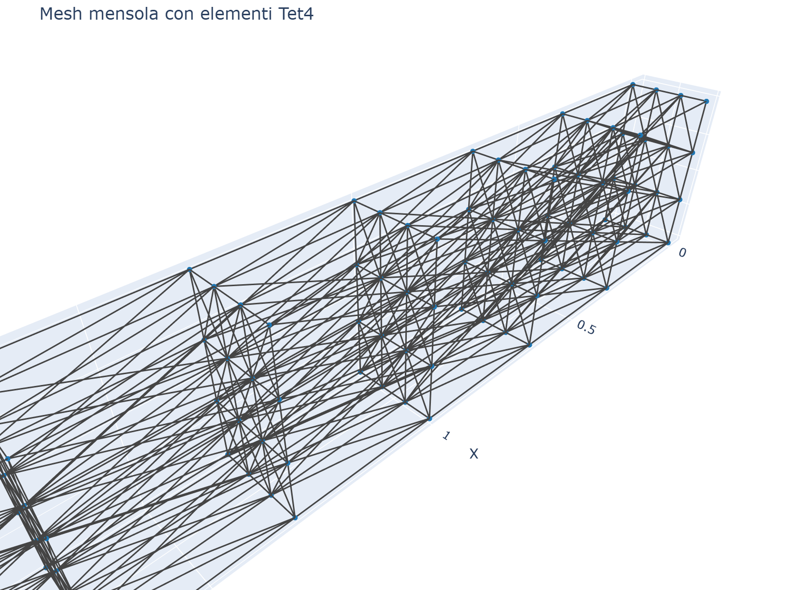
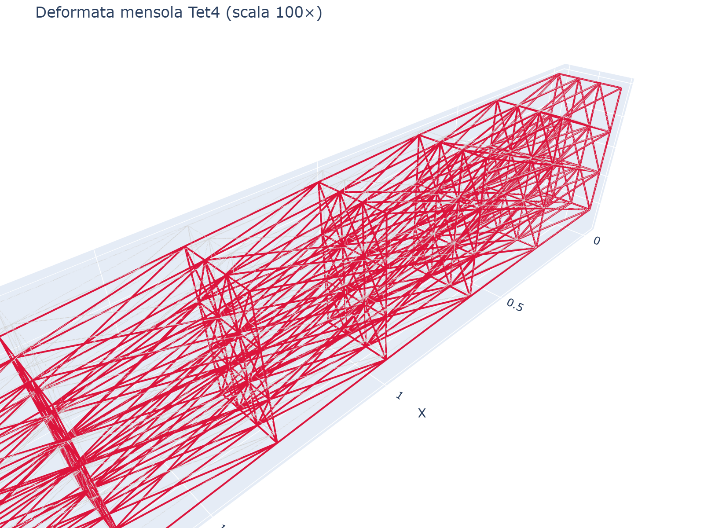
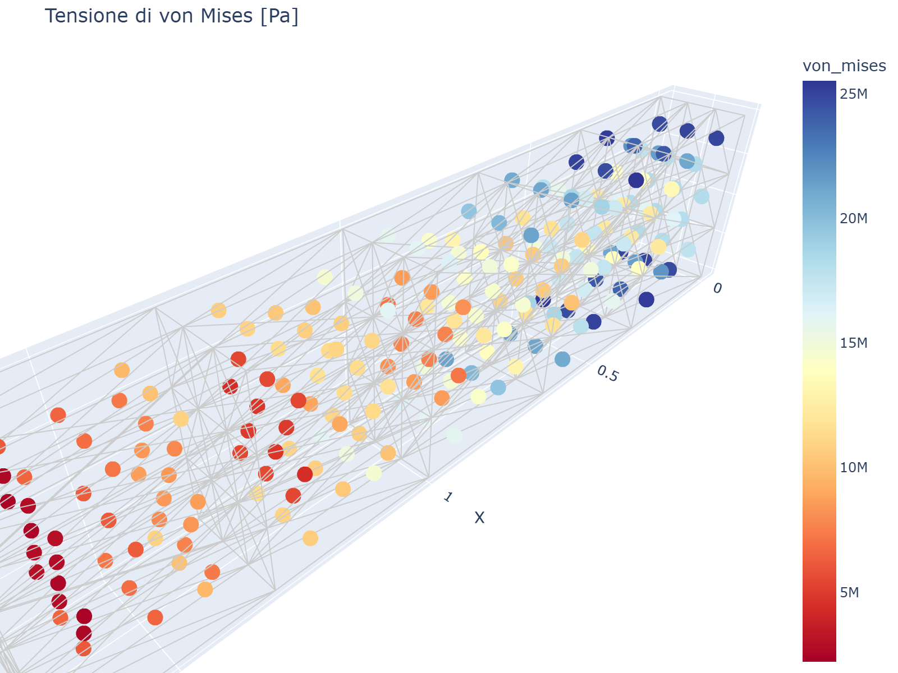

# 08 - Post-Processing

After solving (`res = m.solve()`), you can compute stresses, strains, and
displacements at any point within each element.

## Nodal results

```python
res.displacements(node)           # array [ux, uy, uz]
res.displacement(node, "uz")      # single DOF (float)
res.reactions(node)               # array [Fx, Fy, Fz]
```

## Element stresses

```python
from volumfeapy import postprocess

s = postprocess.element_stresses(res, elem_id)
# Returns dict: sxx, syy, szz, txy, tyz, txz, von_mises
```

Components (Voigt notation):
- `sxx`, `syy`, `szz`: normal stresses
- `txy`, `tyz`, `txz`: shear stresses
- `von_mises`: equivalent von Mises stress

Stresses are computed at the element center (natural coordinates origin).

## Von Mises stress

```python
vm = postprocess.von_mises(sigma)
```

The von Mises equivalent stress is:

```
σ_VM = √(0.5 · ((σxx−σyy)² + (σyy−σzz)² + (σzz−σxx)² + 6·(τxy² + τyz² + τxz²)))
```

Used for ductile material yield criteria (Tresca/von Mises).

## Principal stresses

```python
vals, vecs = postprocess.principal_stresses(sigma)
```

Returns:
- `vals`: principal stresses `[σ1, σ2, σ3]` (sorted descending)
- `vecs`: principal directions (3×3 matrix, columns = eigenvectors)

The principal stresses are the eigenvalues of the stress tensor:

```
[σxx  τxy  τxz]
[τxy  σyy  τyz]
[τxz  τyz  σzz]
```

## All element stresses

```python
all_s = postprocess.all_stresses(res)
# Returns dict: {elem_id: {sxx, syy, szz, txy, tyz, txz, von_mises}}
```

## Maximum von Mises

```python
eid, vm_max = postprocess.max_von_mises(res)
print(f"Max von Mises = {vm_max:.3e} Pa at element {eid}")
```

## Element displacements

```python
u_elem = postprocess.element_displacements(res, elem_id)
# Returns nodal displacement vector (n_dof,)
```

## Complete example

```python
res = m.solve()

# Maximum displacement
u_max = max(np.linalg.norm(res.displacements(nid)) for nid in m.nodes)
print(f"u_max = {u_max:.4e} m")

# Stresses at element center
s = postprocess.element_stresses(res, 1)
print(f"σxx = {s['sxx']:.3e} Pa")
print(f"σyy = {s['syy']:.3e} Pa")
print(f"σzz = {s['szz']:.3e} Pa")
print(f"von Mises = {s['von_mises']:.3e} Pa")

# Principal stresses
vals, vecs = postprocess.principal_stresses(
    np.array([s['sxx'], s['syy'], s['szz'], s['txy'], s['tyz'], s['txz']]))
print(f"σ1 = {vals[0]:.3e} Pa")
print(f"σ2 = {vals[1]:.3e} Pa")
print(f"σ3 = {vals[2]:.3e} Pa")

# Maximum von Mises in the model
eid, vm_max = postprocess.max_von_mises(res)
print(f"Max σ_VM = {vm_max:.3e} Pa at element {eid}")
```

## Visualization examples

The following images show typical post-processing results for 3D solid models.

### Cantilever beam (Tet4 mesh)


*Tetrahedral mesh of a cantilever beam.*


*Deformed shape of a cantilever beam under tip load (scale 100×).*


*Von Mises stress [Pa] in a cantilever beam. Maximum at the fixed end.*

### Stress components

The `plot_stress` function can display any stress component:

```python
from volumfeapy.plotting import plot_stress

# Normal stresses
plot_stress(res, "sxx").show()
plot_stress(res, "syy").show()
plot_stress(res, "szz").show()

# Shear stresses
plot_stress(res, "txy").show()
plot_stress(res, "tyz").show()
plot_stress(res, "txz").show()

# Von Mises
plot_stress(res, "von_mises").show()
```
