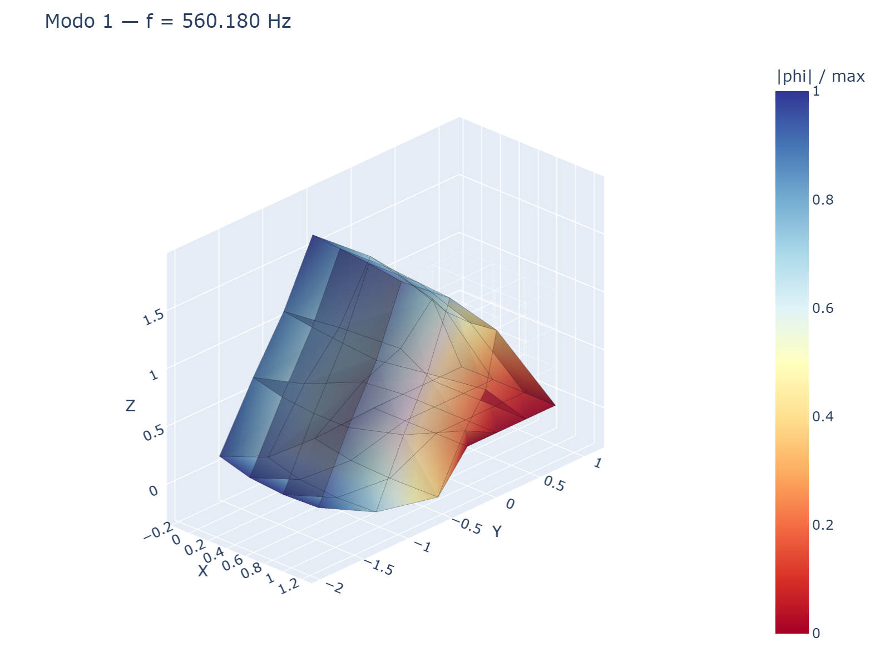
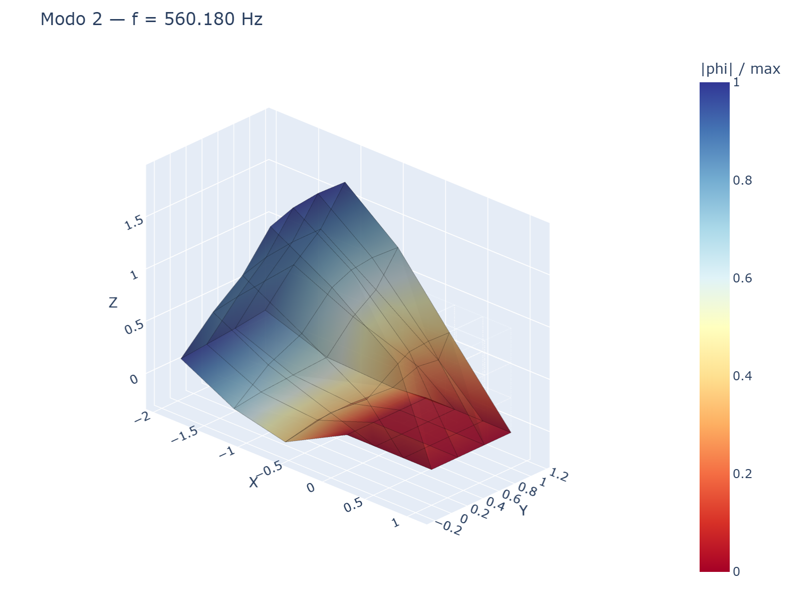
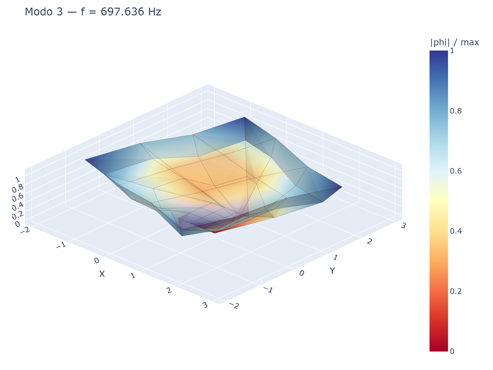

# volumfeapy

Python finite-element solver for static and modal analysis of 3D solid
structures. It covers hexahedral, tetrahedral, wedge and pyramid elements,
body forces, gravity, thermal actions, face pressure, stress recovery, modal
analysis, Plotly visualization, and a Streamlit web UI.

[English documentation](en.md){: .btn .btn-primary }
[Documentazione in italiano](it.md){: .btn }
[GitHub repository](https://github.com/DomenicoGaudioso/volumfeapy){: .btn }

## What You Can Inspect

The deformed solid is displayed against a transparent undeformed reference
wireframe. The plotted geometry can be amplified with a deformation scale
factor, while the colorbar always reports the real displacement norm `|u|` in
meters. Modal plots use `|phi| / max`, so each mode remains readable even
though eigenvectors are normalized internally.

| Hex8 compression/tension block | Tet4 cantilever |
|---|---|
|  |  |

## Results Gallery

| Mesh | von Mises stress | Normal stress |
|---|---|---|
|  |  |  |

| Mode 1 | Mode 2 | Mode 3 |
|---|---|---|
|  |  |  |

## Quick Start

```bash
pip install "volumfeapy[all]"
```

```python
from volumfeapy import Model, Material
from volumfeapy.plotting import plot_deformed

m = Model()
m.add_node(1, 0, 0, 0)
m.add_node(2, 1, 0, 0)
m.add_node(3, 1, 1, 0)
m.add_node(4, 0, 1, 0)
m.add_node(5, 0, 0, 1)
m.add_node(6, 1, 0, 1)
m.add_node(7, 1, 1, 1)
m.add_node(8, 0, 1, 1)

mat = Material(E=210e9, nu=0.3)
m.add_hex8(1, [1, 2, 3, 4, 5, 6, 7, 8], mat)

for nid in range(1, 5):
    m.fix(nid)

m.add_nodal_load(6, Fz=-10000)
res = m.solve()

deformation_scale = 100.0  # visual amplification only
fig = plot_deformed(res, scale=deformation_scale)
fig.show()
```

## Populated Examples

| Case | Script | What it demonstrates |
|---|---|---|
| Uniaxial Hex8 cube | `examples/ex01_uniaxial_hex8.py` | Solid mesh generation, boundary constraints, uniform stress state and displacement recovery |
| Tet4 cantilever | `examples/ex02_cantilever_tet4.py` | Tetrahedral mesh behavior, tip load response, von Mises stress visualization |
| Hex8 convergence | `usage_examples/01_convergence_hex8.py` | Mesh refinement against the closed-form axial deformation |
| Cantilever convergence | `usage_examples/02_cantilever_convergence.py` | Tet4 convergence trend against Euler-Bernoulli beam theory |

Use `scale` only to make the deformed geometry readable in the figure. The
reported displacements, hover values and color legend remain unscaled analysis
results.

## Main Capabilities

- Hex8, Tet4, Tet10, Wedge6 and Pyramid5 solid elements.
- Body forces, gravity, nodal loads, thermal strain and pressure actions.
- Static displacement solution, reactions, element stresses and von Mises stress.
- Modal solver with normalized mode-shape visualization.
- Plotly 3D figures and Streamlit app for interactive modeling checks.

MIT License. Built by Domenico Gaudioso.
