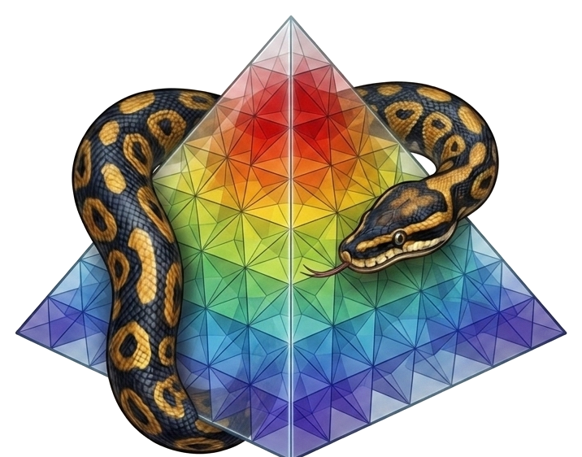

# volumfeapy

<div align="center">
  
</div>

A Python finite-element solver for the **static and modal analysis** of
**3D solid structures** using hexahedral, tetrahedral, wedge and pyramid
elements — body forces, gravity, thermal loads, face pressures, modal analysis,
Plotly visualization and a Streamlit web UI.

---

## Documentation / Documentazione

The documentation is available in two languages with the same set of topics.
La documentazione è disponibile in due lingue con lo stesso insieme di argomenti.

| | |
|---|---|
| 🇬🇧 **[English documentation](en.md)** | Full guide: installation, modeling, element types, loads, analyses, post-processing and Web UI. |
| 🇮🇹 **[Documentazione in italiano](it.md)** | Guida completa: installazione, modellazione, tipi di elemento, carichi, analisi, post-processing e interfaccia web. |

Use the **language sections in the sidebar** (English / Italiano) to browse all
chapters. Use la **barra laterale** per sfogliare tutti i capitoli.

---

## Quick start

```bash
pip install "volumfeapy[all]"
```

```python
from volumfeapy import Model, Material

m = Model()
m.add_node(1, 0, 0, 0); m.add_node(2, 1, 0, 0)
m.add_node(3, 1, 1, 0); m.add_node(4, 0, 1, 0)
m.add_node(5, 0, 0, 1); m.add_node(6, 1, 0, 1)
m.add_node(7, 1, 1, 1); m.add_node(8, 0, 1, 1)

mat = Material(E=210e9, nu=0.3)
m.add_hex8(1, [1, 2, 3, 4, 5, 6, 7, 8], mat)

for nid in range(1, 5):
    m.fix(nid)

m.add_nodal_load(6, Fz=-10000)
res = m.solve()
print(res.displacements(6))
```

→ Continue with the [English Quick Start](en-02-quick-start.md) or the
[Quick Start in italiano](it-02-quick-start.md).

---

## Key features

- **Hex8** (8-node hexahedron, trilinear, 2×2×2 Gauss)
- **Tet4** (4-node tetrahedron, linear, constant strain)
- **Tet10** (10-node tetrahedron, quadratic, 4-point Gauss)
- **Wedge6** (6-node wedge/prism)
- **Pyramid5** (5-node pyramid)
- **Loads**: body forces, gravity, thermal, face pressure, settlements
- **Modal analysis** (natural frequencies, mode shapes)
- **Post-processing**: stresses, von Mises, principal stresses
- **Plotly** 3D plots and a **Streamlit web UI** (`app.py`)

## License

MIT — see `LICENSE`. Built by Domenico Gaudioso.
