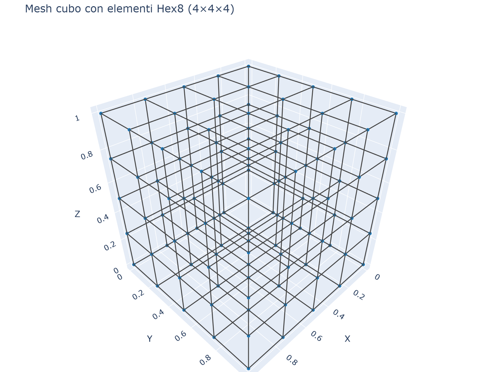
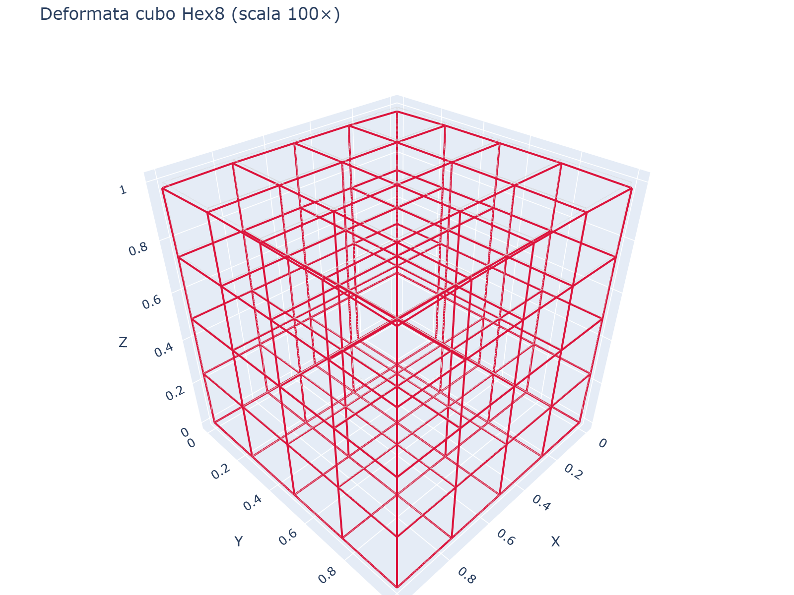
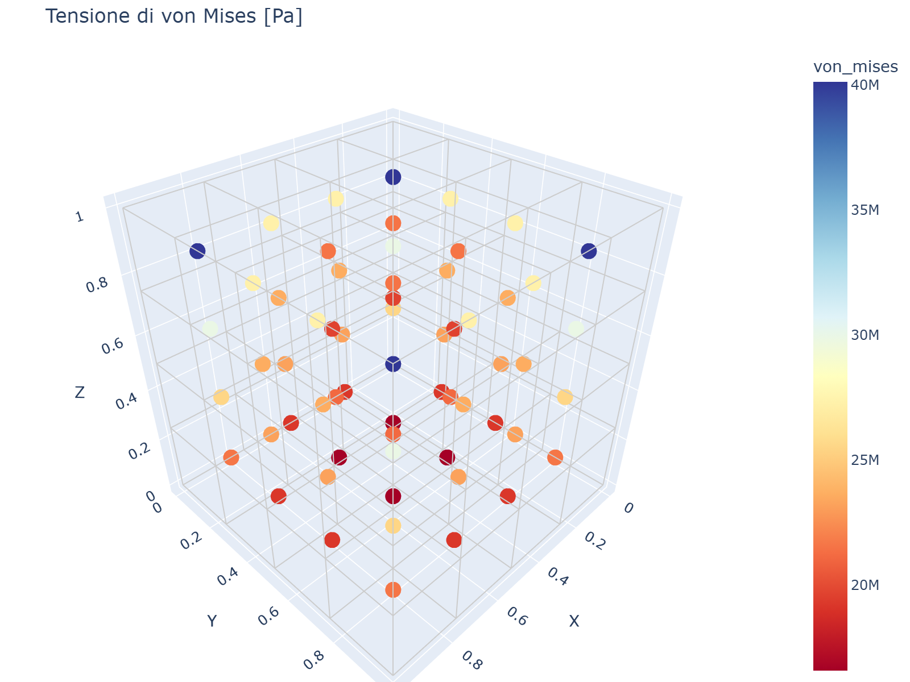
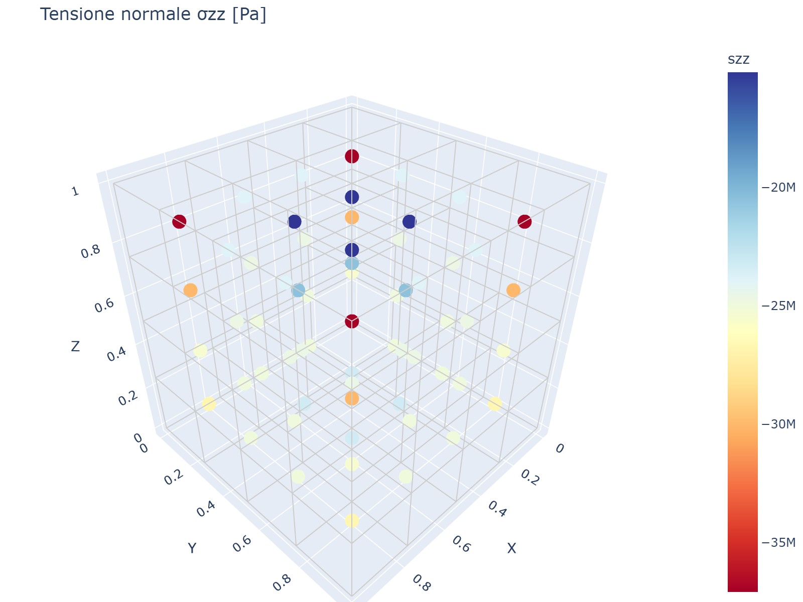

# 02 - Quick Start

Il primo modello: un cubo unitario in trazione uniassiale.

```python
from volumfeapy import Model, Material

# 1. Creare il modello
m = Model()

# 2. Aggiungere i nodi (cubo unitario)
m.add_node(1, 0, 0, 0)
m.add_node(2, 1, 0, 0)
m.add_node(3, 1, 1, 0)
m.add_node(4, 0, 1, 0)
m.add_node(5, 0, 0, 1)
m.add_node(6, 1, 0, 1)
m.add_node(7, 1, 1, 1)
m.add_node(8, 0, 1, 1)

# 3. Definire il materiale
mat = Material(E=210e9, nu=0.3)       # acciaio

# 4. Aggiungere elemento esaedrico
m.add_hex8(1, [1, 2, 3, 4, 5, 6, 7, 8], mat)

# 5. Applicare vincoli (fissare faccia inferiore)
for nid in [1, 2, 3, 4]:
    m.fix(nid)

# 6. Applicare carico di trazione sulla faccia superiore
F = 1e6  # 1 MN totale
for nid in [5, 6, 7, 8]:
    m.add_nodal_load(nid, Fz=F / 4.0)

# 7. Risolvere
res = m.solve()

# 8. Leggere i risultati
print(res.displacements(5))   # [ux, uy, uz] al nodo 5
```

## Risultato atteso

Per trazione uniassiale: `σ_zz = F/A`, `u_z = F·L/(E·A)`

```python
u_exact = F * 1.0 / (210e9 * 1.0)
print(f"uz FEM   = {res.displacement(5, 'uz'):.6e} m")
print(f"uz esatto = {u_exact:.6e} m")
```

## Visualizzazione

Dopo la soluzione, puoi visualizzare la mesh e i risultati:

```python
from volumfeapy.plotting import plot_mesh, plot_deformed, plot_stress

plot_mesh(m).show()
plot_deformed(res, scale=100).show()
plot_stress(res, "von_mises").show()
```

### Mesh


*Mesh esaedrica 4×4×4 di un cubo unitario.*

### Forma deformata


*Forma deformata (scala 100×) sotto trazione uniassiale.*

### Tensione di von Mises


*Mappa di contorno della tensione equivalente di von Mises [Pa].*

### Tensione normale σzz


*Mappa di contorno della tensione normale σzz [Pa].*

## Prossimi passi

- [Modello Strutturale](it-03-structural-model.md) — nodi, materiali, elementi
- [Tipi di Elemento](it-04-element-types.md) — Hex8, Tet4, Tet10, Wedge6, Pyramid5
- [Carichi](it-05-loads.md) — forze di volume, gravità, termici, pressione
- [Post-Processing](it-08-post-processing.md) — tensioni, von Mises, tensioni principali
