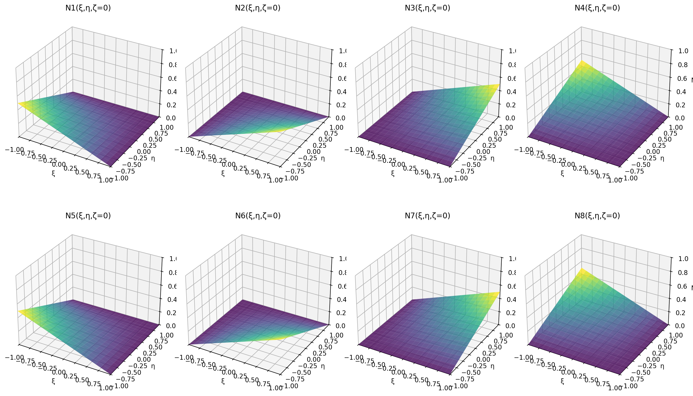
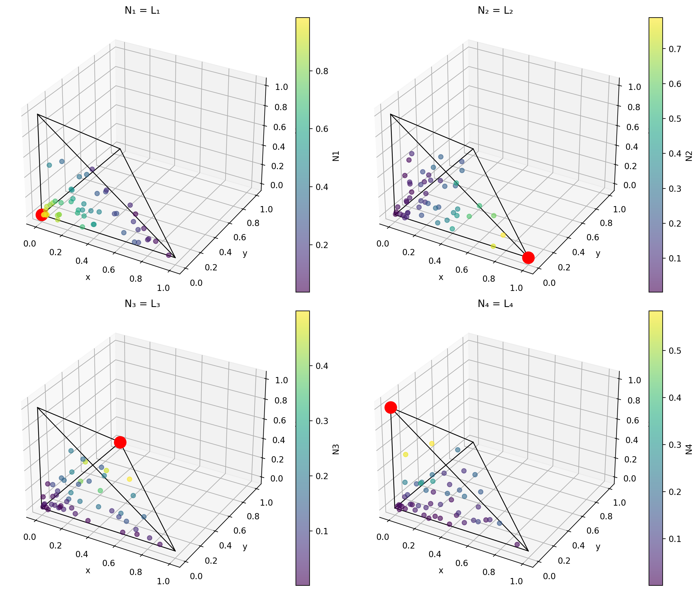

# 16 - Funzioni di Forma

Le funzioni di forma sono il fondamento matematico del metodo degli elementi finiti. Interpolano il campo di spostamenti all'interno di un elemento a partire dai valori nodali.

## Elemento Hex8 (Esaedro 8 nodi)

L'elemento Hex8 utilizza **funzioni di forma trilineari** definite in coordinate naturali (ξ, η, ζ) ∈ [-1, 1]³.

### Definizioni delle Funzioni di Forma

Per un elemento esaedrico con nodi numerati secondo la convenzione:

```
Nᵢ(ξ,η,ζ) = ⅛(1 + ξᵢ·ξ)(1 + ηᵢ·η)(1 + ζᵢ·ζ)
```

dove (ξᵢ, ηᵢ, ζᵢ) sono le coordinate naturali del nodo i:

| Nodo | ξᵢ | ηᵢ | ζᵢ |
|------|----|----|----|
| 1 | -1 | -1 | -1 |
| 2 | +1 | -1 | -1 |
| 3 | +1 | +1 | -1 |
| 4 | -1 | +1 | -1 |
| 5 | -1 | -1 | +1 |
| 6 | +1 | -1 | +1 |
| 7 | +1 | +1 | +1 |
| 8 | -1 | +1 | +1 |

### Proprietà

1. **Partizione dell'unità**: Σ Nᵢ = 1 ovunque
2. **Delta di Kronecker**: Nᵢ(ξⱼ, ηⱼ, ζⱼ) = δᵢⱼ
3. **Lineari lungo gli spigoli**: variano linearmente lungo ogni spigolo dell'elemento
4. **Trilineari all'interno**: prodotto di funzioni lineari in ξ, η e ζ

### Visualizzazione


*Le otto funzioni di forma trilineari valutate a ζ=0 (piano medio).*

### Interpolazione degli Spostamenti

Lo spostamento in qualsiasi punto (ξ, η, ζ) è:

```
u(ξ,η,ζ) = Σᵢ Nᵢ·uᵢ
v(ξ,η,ζ) = Σᵢ Nᵢ·vᵢ
w(ξ,η,ζ) = Σᵢ Nᵢ·wᵢ
```

## Elemento Tet4 (Tetraedro 4 nodi)

L'elemento Tet4 utilizza **funzioni di forma lineari** definite in coordinate baricentriche (di volume) (L₁, L₂, L₃, L₄) dove L₁ + L₂ + L₃ + L₄ = 1.

### Definizioni delle Funzioni di Forma

```
N₁ = L₁
N₂ = L₂
N₃ = L₃
N₄ = L₄
```

### Proprietà

1. **Partizione dell'unità**: L₁ + L₂ + L₃ + L₄ = 1
2. **Delta di Kronecker**: Nᵢ al nodo j = δᵢⱼ
3. **Variazione lineare**: lo spostamento varia linearmente all'interno dell'elemento
4. **Deformazione costante**: deformazione e tensione sono costanti all'interno dell'elemento

### Visualizzazione


*Le quattro funzioni di forma lineari per un elemento tetraedrico. Ogni funzione vale 1 al proprio nodo e 0 sulla faccia opposta.*

### Coordinate Baricentriche

Le coordinate baricentriche (L₁, L₂, L₃, L₄) rappresentano i rapporti di volume:

```
Lᵢ = Vᵢ / V
```

dove Vᵢ è il volume del sotto-tetraedro opposto al nodo i, e V è il volume totale dell'elemento.

### Trasformazione di Coordinate

Da coordinate baricentriche a cartesiane:

```
x = L₁·x₁ + L₂·x₂ + L₃·x₃ + L₄·x₄
y = L₁·y₁ + L₂·y₂ + L₃·y₃ + L₄·y₄
z = L₁·z₁ + L₂·z₂ + L₃·z₃ + L₄·z₄
```

## Elemento Tet10 (Tetraedro 10 nodi)

L'elemento Tet10 utilizza **funzioni di forma quadratiche** con 4 nodi ai vertici e 6 nodi ai punti medi degli spigoli.

### Definizioni delle Funzioni di Forma

Per i nodi ai vertici (i = 1, 2, 3, 4):

```
Nᵢ = Lᵢ(2Lᵢ - 1)
```

Per i nodi ai punti medi (i = 5, 6, ..., 10) tra i vertici j e k:

```
Nᵢ = 4·Lⱼ·Lₖ
```

### Proprietà

1. **Variazione quadratica**: lo spostamento varia quadraticamente all'interno dell'elemento
2. **Deformazione lineare**: deformazione e tensione variano linearmente all'interno dell'elemento
3. **Maggiore accuratezza**: molto più accurato del Tet4 a parità di mesh

## Schemi di Integrazione

### Integrazione Hex8

Utilizza la **quadratura di Gauss** in coordinate naturali:

```
∫∫∫ f(ξ,η,ζ) dξ dη dζ ≈ Σᵢ Σⱼ Σₖ wᵢ·wⱼ·wₖ·f(ξᵢ, ηⱼ, ζₖ)
```

| Schema | Punti | Accuratezza | Uso |
|--------|-------|-------------|-----|
| 1×1×1 | 1 | Lineare | Integrazione ridotta |
| 2×2×2 | 8 | Cubica | Integrazione completa (default) |
| 3×3×3 | 27 | Quintica | Ordine superiore |

### Integrazione Tet4

Utilizza la **regola di Gauss a 1 punto** (esatta per funzioni lineari):

```
∫∫∫ f(L₁,L₂,L₃,L₄) dV ≈ V · f(¼, ¼, ¼, ¼)
```

dove V è il volume dell'elemento.

### Integrazione Tet10

Utilizza la **regola di Gauss a 4 punti** (esatta per funzioni quadratiche):

| Punto | L₁ | L₂ | L₃ | L₄ | Peso |
|-------|----|----|----|----|----|
| 1 | α | β | β | β | V/4 |
| 2 | β | α | β | β | V/4 |
| 3 | β | β | α | β | V/4 |
| 4 | β | β | β | α | V/4 |

dove α = (5-√5)/20 ≈ 0.1382 e β = (5+3√5)/20 ≈ 0.5854.

## Matrice Jacobiana

La matrice Jacobiana J relaciona le derivate in coordinate naturali e fisiche:

### Per Hex8:

```
J = [∂x/∂ξ  ∂y/∂ξ  ∂z/∂ξ]
    [∂x/∂η  ∂y/∂η  ∂z/∂η]
    [∂x/∂ζ  ∂y/∂ζ  ∂z/∂ζ]
```

### Per Tet4/Tet10:

Lo Jacobiano è costante per Tet4 e relaciona le derivate baricentriche a cartesiane.

Il determinante |J| deve essere positivo ovunque per un elemento valido.

## Implementazione

In volumfeapy, le funzioni di forma sono implementate nelle classi degli elementi:

```python
class Hex8:
    def _shape_functions(self, xi, eta, zeta):
        """Funzioni di forma trilineari N1..N8."""
        return 0.125 * np.array([
            (1 - xi) * (1 - eta) * (1 - zeta),
            (1 + xi) * (1 - eta) * (1 - zeta),
            (1 + xi) * (1 + eta) * (1 - zeta),
            (1 - xi) * (1 + eta) * (1 - zeta),
            (1 - xi) * (1 - eta) * (1 + zeta),
            (1 + xi) * (1 - eta) * (1 + zeta),
            (1 + xi) * (1 + eta) * (1 + zeta),
            (1 - xi) * (1 + eta) * (1 + zeta),
        ])
```

La matrice B (deformazione-spostamento) è calcolata utilizzando le derivate delle funzioni di forma e l'inversa dello Jacobiano.

## Riferimenti

- Zienkiewicz, O.C., Taylor, R.L. (2000). *The Finite Element Method*, Vol. 1. Butterworth-Heinemann.
- Hughes, T.J.R. (1987). *The Finite Element Method*. Prentice-Hall.
- Bathe, K.J. (1996). *Finite Element Procedures*. Prentice-Hall.
